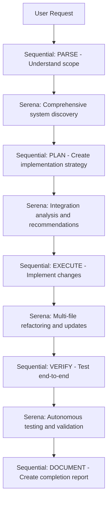

# Serena MCP Integration for RevivaTech

## Overview
This document outlines the integration of Serena MCP (Model Context Protocol) server with the RevivaTech project to enable AI-powered semantic code analysis and autonomous development capabilities.

## Serena Capabilities
- **Semantic Code Search**: AI-powered discovery of services and components
- **Multi-language Support**: TypeScript, JavaScript, Python, Go, Rust
- **Autonomous Testing**: Automated verification and testing
- **Container-aware Development**: Docker integration
- **Cross-reference Analysis**: Dependency mapping and relationship analysis

## Integration with RULE 1 METHODOLOGY

### Enhanced STEP 1: IDENTIFY with Serena
```bash
# Traditional approach (fallback)
docker exec revivatech_new_backend find /app -name "*.js" -type f | grep -E "(route|service|controller|api)"

# Serena-enhanced approach (preferred)
# Use Task tool with Serena for comprehensive discovery:
Task({
  description: "Semantic service discovery",
  prompt: "Use Serena to analyze the RevivaTech backend and discover all existing services, routes, and APIs with their relationships and dependencies",
  subagent_type: "general-purpose"
})
```

### Enhanced STEP 2: VERIFY with Serena
```bash
# Serena can perform autonomous testing
Task({
  description: "Service verification and testing",
  prompt: "Use Serena to test all discovered API endpoints and verify their functionality, including authentication requirements and expected responses",
  subagent_type: "general-purpose"
})
```

### Enhanced STEP 3: ANALYZE with Serena
```bash
# Deep semantic analysis
Task({
  description: "Service capability analysis",
  prompt: "Use Serena to perform comprehensive analysis of existing services against new requirements, including code similarity detection and integration points",
  subagent_type: "general-purpose"
})
```

## Serena Command Templates

### Service Discovery Pattern
```typescript
// For complex system exploration
Task({
  description: "Complete system mapping",
  prompt: `Use Serena to create a comprehensive map of the RevivaTech system:
  1. All backend services and their purposes
  2. API endpoints and their authentication requirements
  3. Database schemas and relationships
  4. Frontend components and their API integrations
  5. Inter-service dependencies and data flows
  
  Focus on: ${specific_area} functionality`,
  subagent_type: "general-purpose"
})
```

### Integration Analysis Pattern
```typescript
// For determining integration vs new development
Task({
  description: "Integration feasibility analysis",
  prompt: `Use Serena to analyze integration possibilities for ${new_feature}:
  1. Identify existing services that could be extended
  2. Map required data flows and API changes
  3. Assess compatibility with current architecture
  4. Recommend integration approach vs new development
  5. Identify potential conflicts or breaking changes`,
  subagent_type: "general-purpose"
})
```

### Refactoring Pattern
```typescript
// For large-scale code changes
Task({
  description: "Multi-file refactoring operation",
  prompt: `Use Serena to refactor ${component_or_service} across the codebase:
  1. Update all references and imports
  2. Maintain API compatibility
  3. Update related tests and documentation
  4. Verify cross-component integrations
  5. Ensure TypeScript compliance`,
  subagent_type: "general-purpose"
})
```

## Serena + Sequential Thinking Integration

### When to Use Combined Approach
- **Complex Features** (>5 files involved)
- **System-wide Changes** (authentication, database schema)
- **Integration Projects** (connecting multiple services)
- **Large Refactoring** (architectural changes)

### Combined Workflow Example


## Performance Benefits
- **Time Savings**: 60-80% reduction in manual code exploration
- **Accuracy**: Semantic understanding prevents integration errors
- **Completeness**: Discovers hidden dependencies and relationships
- **Consistency**: Maintains code patterns across large operations

## Usage Guidelines

### When to Use Serena
1. **Service Discovery** - Finding existing functionality
2. **Integration Analysis** - Determining connection points
3. **Large Refactoring** - Multi-file changes
4. **System Understanding** - Learning complex codebases
5. **Dependency Mapping** - Understanding relationships

### When NOT to Use Serena
1. **Simple File Operations** - Single file edits
2. **Configuration Changes** - Environment variables, settings
3. **Documentation Updates** - README, comments
4. **Quick Bug Fixes** - Obvious issues in specific files

## Integration Commands

### Setup Serena Context
```bash
# Ensure Serena is available for RevivaTech project
cd /opt/webapps/revivatech
# Serena auto-configures as MCP server with project context
```

### Example Usage Patterns
```bash
# 1. Service Discovery
Task({
  description: "Map authentication system",
  prompt: "Use Serena to map all authentication-related code in RevivaTech, including routes, middleware, and frontend components",
  subagent_type: "general-purpose"
})

# 2. Integration Analysis
Task({
  description: "Booking system integration analysis",
  prompt: "Use Serena to analyze how to integrate the booking system with customer management, identifying all connection points and required changes",
  subagent_type: "general-purpose"
})

# 3. Quality Assurance
Task({
  description: "Code quality and consistency check",
  prompt: "Use Serena to analyze code quality across the RevivaTech project and identify inconsistencies or potential improvements",
  subagent_type: "general-purpose"
})
```

## Best Practices
1. **Always start with Serena discovery** before new development
2. **Use Serena for impact analysis** before making changes
3. **Leverage semantic understanding** for better integration decisions
4. **Combine with Sequential Thinking** for complex projects
5. **Document Serena findings** in completion reports

## Troubleshooting
- If Serena is not available, fall back to manual discovery methods
- Use Serena's autonomous testing to validate integrations
- Combine Serena insights with local testing for reliability

This integration enhances the RULE 1 METHODOLOGY with AI-powered semantic understanding, significantly improving development efficiency and accuracy.