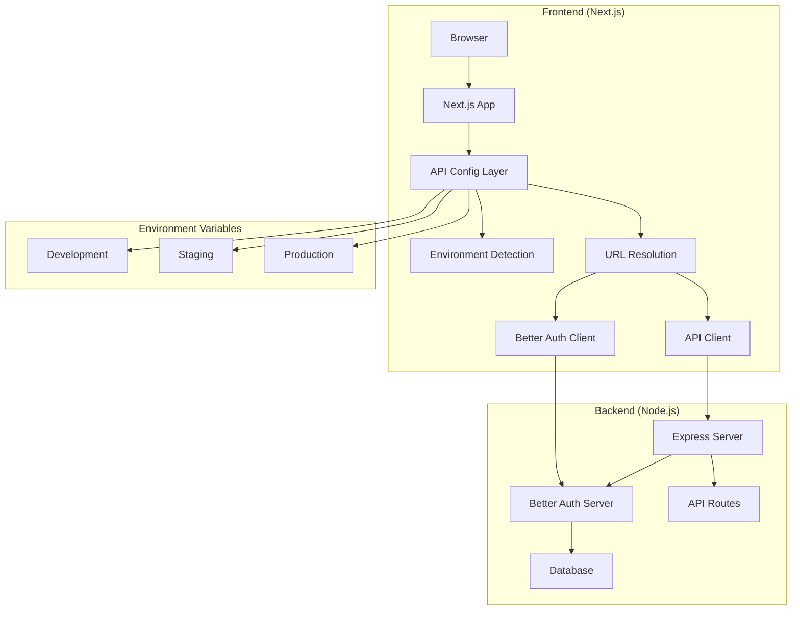
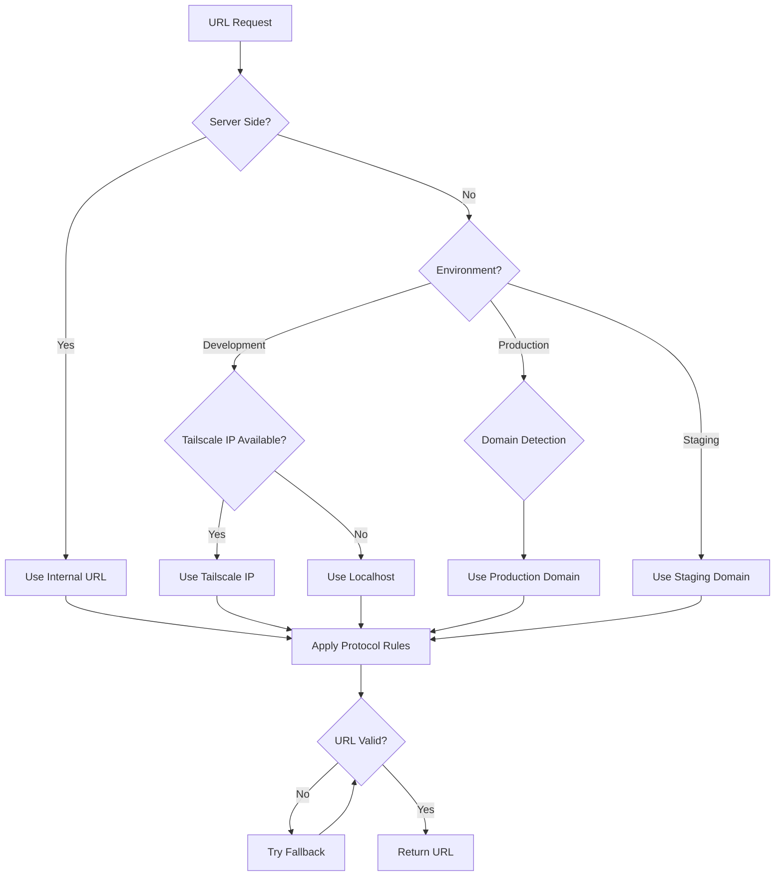

# API Routing Standardization Technical Design

## Architecture Overview

This document outlines the technical design for standardizing API routing across the RevivaTech application, ensuring consistent behavior across development, staging, and production environments while maintaining security and performance requirements.

## Design Principles

### 1. Environment Awareness
- **Dynamic Configuration**: All URL resolution must adapt to the current environment
- **No Hardcoding**: Zero hardcoded IPs, domains, or environment-specific values
- **Graceful Degradation**: Fallback mechanisms for configuration failures

### 2. Security First
- **HTTPS Enforcement**: Mandatory HTTPS in production environments
- **Secure Defaults**: Safe configuration defaults that enhance security
- **Least Privilege**: Minimal necessary permissions and access

### 3. Developer Experience
- **Hot Reload Compatibility**: Changes must not break development workflow
- **Clear Error Messages**: Helpful debugging information for configuration issues
- **Consistent Patterns**: Predictable configuration patterns across the application

### 4. Performance Optimization
- **Minimal Overhead**: URL resolution should not impact application performance
- **Caching Strategy**: Intelligent caching of resolved URLs
- **Efficient Fallbacks**: Fast failover for URL resolution failures

## System Architecture



## URL Resolution Strategy

### Current State Analysis

The existing `api-config.ts` provides sophisticated environment-aware URL resolution:

```typescript
// Current implementation strengths:
- Server/client-side detection via `typeof window === 'undefined'`
- Dynamic hostname detection for production domains
- Container-aware internal/external URL separation
- Environment variable fallbacks
```

### Enhanced URL Resolution Design

```typescript
interface URLResolutionConfig {
  // Core configuration
  environment: 'development' | 'staging' | 'production'
  isServerSide: boolean
  hostname: string
  
  // URL patterns
  internalApiUrl: string      // Container-to-container
  externalApiUrl: string      // Browser-to-server  
  authBaseUrl: string         // Better Auth
  websocketUrl: string        // WebSocket connections
  
  // Fallback URLs
  fallbackUrls: string[]
}
```

### URL Resolution Flow



## Environment Variable Design

### Standardized Naming Convention

```bash
# API Base URLs
NEXT_PUBLIC_API_URL=              # External API URL for client-side
BACKEND_INTERNAL_URL=             # Internal container-to-container URL
API_FALLBACK_URL=                 # Fallback API URL

# Authentication URLs  
BETTER_AUTH_URL=                  # Better Auth base URL
NEXT_PUBLIC_APP_URL=              # Frontend application URL
AUTH_FALLBACK_URL=                # Authentication fallback URL

# Development Configuration
TAILSCALE_DEV_IP=                 # Dynamic Tailscale IP (no hardcoding)
DEV_API_PORT=3011                 # Development API port
DEV_FRONTEND_PORT=3010            # Development frontend port

# Production Configuration
PROD_API_DOMAIN=api.revivatech.co.uk
PROD_FRONTEND_DOMAIN=revivatech.co.uk
PROD_PROTOCOL=https

# Security Configuration
CORS_ALLOWED_ORIGINS=             # Comma-separated allowed origins
SECURE_COOKIES=true               # Force secure cookies in production
HTTPS_ONLY=true                   # Enforce HTTPS in production
```

### Environment-Specific Configurations

#### Development Environment
```bash
NODE_ENV=development
NEXT_PUBLIC_API_URL=              # Empty - use dynamic resolution
BACKEND_INTERNAL_URL=http://revivatech_backend:3011
BETTER_AUTH_URL=http://localhost:3010
TAILSCALE_DEV_IP=                 # Set dynamically, never hardcoded
SECURE_COOKIES=false
HTTPS_ONLY=false
```

#### Production Environment  
```bash
NODE_ENV=production
NEXT_PUBLIC_API_URL=https://api.revivatech.co.uk
BACKEND_INTERNAL_URL=http://revivatech_backend:3011
BETTER_AUTH_URL=https://revivatech.co.uk
SECURE_COOKIES=true
HTTPS_ONLY=true
CORS_ALLOWED_ORIGINS=https://revivatech.co.uk,https://revivatech.com.br
```

## Configuration Management

### Environment Detection Logic

```typescript
class EnvironmentDetector {
  static detect(): EnvironmentConfig {
    const nodeEnv = process.env.NODE_ENV;
    const hostname = typeof window !== 'undefined' 
      ? window.location.hostname 
      : 'server';
    
    return {
      environment: nodeEnv as Environment,
      isServerSide: typeof window === 'undefined',
      hostname,
      isProduction: nodeEnv === 'production',
      isDevelopment: nodeEnv === 'development',
      isStaging: nodeEnv === 'staging'
    };
  }
}
```

### Dynamic URL Resolution

```typescript
class URLResolver {
  private config: EnvironmentConfig;
  
  constructor() {
    this.config = EnvironmentDetector.detect();
  }
  
  getApiUrl(): string {
    if (this.config.isServerSide) {
      return this.getInternalApiUrl();
    }
    
    return this.getExternalApiUrl();
  }
  
  private getInternalApiUrl(): string {
    return process.env.BACKEND_INTERNAL_URL 
      || 'http://revivatech_backend:3011';
  }
  
  private getExternalApiUrl(): string {
    // Explicit environment variable takes precedence
    if (process.env.NEXT_PUBLIC_API_URL) {
      return process.env.NEXT_PUBLIC_API_URL;
    }
    
    // Production domain detection
    if (this.config.hostname.includes('revivatech.co.uk')) {
      return 'https://api.revivatech.co.uk';
    }
    
    // Development: dynamic Tailscale IP or localhost
    if (this.config.isDevelopment) {
      const tailscaleIP = process.env.TAILSCALE_DEV_IP;
      if (tailscaleIP) {
        return `http://${tailscaleIP}:${process.env.DEV_API_PORT || 3011}`;
      }
      return `http://localhost:${process.env.DEV_API_PORT || 3011}`;
    }
    
    // Fallback to relative path
    return '';
  }
}
```

## Better Auth Integration Design

### Authentication URL Configuration

```typescript
// better-auth-server.ts (Backend)
export const auth = betterAuth({
  baseURL: getAuthBaseURL(),
  plugins: [
    emailAndPassword({
      enabled: true,
      requireEmailVerification: false
    })
  ],
  cookies: {
    secure: process.env.NODE_ENV === 'production',
    sameSite: 'lax',
    domain: process.env.NODE_ENV === 'production' 
      ? getDomainFromURL(getAuthBaseURL())
      : undefined
  },
  cors: {
    origin: getAllowedOrigins(),
    credentials: true
  }
});

function getAuthBaseURL(): string {
  if (process.env.BETTER_AUTH_URL) {
    return process.env.BETTER_AUTH_URL;
  }
  
  if (process.env.NODE_ENV === 'production') {
    return 'https://revivatech.co.uk';
  }
  
  return 'http://localhost:3010';
}
```

```typescript  
// better-auth-client.ts (Frontend)
function getAuthBaseURL(): string {
  // Use explicit configuration first
  if (process.env.NEXT_PUBLIC_APP_URL) {
    return process.env.NEXT_PUBLIC_APP_URL;
  }
  
  // Client-side: detect from current location
  if (typeof window !== 'undefined') {
    const hostname = window.location.hostname;
    const protocol = window.location.protocol;
    
    // Production domain detection
    if (hostname.includes('revivatech.co.uk')) {
      return `${protocol}//${hostname}`;
    }
    
    // Development: use current origin
    return window.location.origin;
  }
  
  // Server-side fallback
  return process.env.BETTER_AUTH_URL || 'http://localhost:3010';
}
```

## Security Configuration Design

### CORS Policy Management

```typescript
interface CORSConfig {
  allowedOrigins: string[];
  allowCredentials: boolean;
  allowedMethods: string[];
  allowedHeaders: string[];
}

class CORSManager {
  static getConfig(environment: Environment): CORSConfig {
    const base: CORSConfig = {
      allowCredentials: true,
      allowedMethods: ['GET', 'POST', 'PUT', 'DELETE', 'OPTIONS'],
      allowedHeaders: ['Content-Type', 'Authorization', 'X-Requested-With']
    };
    
    switch (environment) {
      case Environment.DEVELOPMENT:
        return {
          ...base,
          allowedOrigins: [
            'http://localhost:3010',
            'https://localhost:3010',
            ...(process.env.TAILSCALE_DEV_IP ? 
              [`http://${process.env.TAILSCALE_DEV_IP}:3010`] : []
            )
          ]
        };
        
      case Environment.PRODUCTION:
        return {
          ...base,
          allowedOrigins: [
            'https://revivatech.co.uk',
            'https://revivatech.com.br'
          ]
        };
        
      default:
        return base;
    }
  }
}
```

### Cookie Security Configuration

```typescript
interface CookieConfig {
  secure: boolean;
  httpOnly: boolean;
  sameSite: 'strict' | 'lax' | 'none';
  domain?: string;
  maxAge: number;
}

class CookieManager {
  static getConfig(environment: Environment): CookieConfig {
    const isProduction = environment === Environment.PRODUCTION;
    
    return {
      secure: isProduction,
      httpOnly: true,
      sameSite: isProduction ? 'strict' : 'lax',
      domain: isProduction ? '.revivatech.co.uk' : undefined,
      maxAge: 7 * 24 * 60 * 60 * 1000 // 7 days
    };
  }
}
```

## Error Handling and Fallback Design

### Fallback URL Resolution

```typescript
class FallbackURLResolver {
  private primaryResolver: URLResolver;
  private fallbackUrls: string[];
  
  constructor() {
    this.primaryResolver = new URLResolver();
    this.fallbackUrls = this.getFallbackUrls();
  }
  
  async resolveWithFallback(): Promise<string> {
    // Try primary resolution
    try {
      const primaryUrl = this.primaryResolver.getApiUrl();
      if (await this.validateUrl(primaryUrl)) {
        return primaryUrl;
      }
    } catch (error) {
      console.warn('Primary URL resolution failed:', error);
    }
    
    // Try fallback URLs
    for (const fallbackUrl of this.fallbackUrls) {
      try {
        if (await this.validateUrl(fallbackUrl)) {
          console.warn('Using fallback URL:', fallbackUrl);
          return fallbackUrl;
        }
      } catch (error) {
        console.warn('Fallback URL failed:', fallbackUrl, error);
      }
    }
    
    throw new Error('All URL resolution attempts failed');
  }
  
  private async validateUrl(url: string): Promise<boolean> {
    if (!url) return false;
    
    try {
      const response = await fetch(`${url}/health`, {
        method: 'GET',
        timeout: 5000
      });
      return response.ok;
    } catch {
      return false;
    }
  }
  
  private getFallbackUrls(): string[] {
    const fallbacks = [];
    
    if (process.env.API_FALLBACK_URL) {
      fallbacks.push(process.env.API_FALLBACK_URL);
    }
    
    // Environment-specific fallbacks
    if (process.env.NODE_ENV === 'development') {
      fallbacks.push('http://localhost:3011');
      if (process.env.TAILSCALE_DEV_IP) {
        fallbacks.push(`http://${process.env.TAILSCALE_DEV_IP}:3011`);
      }
    }
    
    return fallbacks;
  }
}
```

### API Client Error Handling

```typescript
class RobustAPIClient {
  private urlResolver: FallbackURLResolver;
  private retryConfig: RetryConfig;
  
  constructor() {
    this.urlResolver = new FallbackURLResolver();
    this.retryConfig = {
      maxRetries: 3,
      baseDelay: 1000,
      maxDelay: 5000,
      backoffFactor: 2
    };
  }
  
  async request(endpoint: string, options: RequestOptions): Promise<Response> {
    const baseUrl = await this.urlResolver.resolveWithFallback();
    const url = `${baseUrl}${endpoint}`;
    
    return this.retryWithBackoff(async () => {
      const response = await fetch(url, {
        ...options,
        headers: {
          'Content-Type': 'application/json',
          ...options.headers
        }
      });
      
      if (!response.ok) {
        throw new APIError(response.status, response.statusText, url);
      }
      
      return response;
    });
  }
  
  private async retryWithBackoff<T>(
    operation: () => Promise<T>
  ): Promise<T> {
    let lastError: Error;
    
    for (let attempt = 0; attempt <= this.retryConfig.maxRetries; attempt++) {
      try {
        return await operation();
      } catch (error) {
        lastError = error as Error;
        
        if (attempt === this.retryConfig.maxRetries) {
          break;
        }
        
        const delay = Math.min(
          this.retryConfig.baseDelay * Math.pow(this.retryConfig.backoffFactor, attempt),
          this.retryConfig.maxDelay
        );
        
        await new Promise(resolve => setTimeout(resolve, delay));
      }
    }
    
    throw lastError!;
  }
}
```

## Configuration Validation Design

### Environment Validation

```typescript
interface ValidationResult {
  isValid: boolean;
  errors: string[];
  warnings: string[];
}

class ConfigurationValidator {
  static validate(): ValidationResult {
    const result: ValidationResult = {
      isValid: true,
      errors: [],
      warnings: []
    };
    
    // Validate required environment variables
    this.validateRequiredVars(result);
    
    // Validate URL formats
    this.validateURLs(result);
    
    // Validate security configuration
    this.validateSecurity(result);
    
    // Check for hardcoded values
    this.checkForHardcodedValues(result);
    
    return result;
  }
  
  private static validateRequiredVars(result: ValidationResult): void {
    const required = [
      'NODE_ENV',
      'BACKEND_INTERNAL_URL'
    ];
    
    for (const varName of required) {
      if (!process.env[varName]) {
        result.errors.push(`Missing required environment variable: ${varName}`);
        result.isValid = false;
      }
    }
  }
  
  private static validateURLs(result: ValidationResult): void {
    const urlVars = [
      'NEXT_PUBLIC_API_URL',
      'BACKEND_INTERNAL_URL',
      'BETTER_AUTH_URL'
    ];
    
    for (const varName of urlVars) {
      const value = process.env[varName];
      if (value && !this.isValidURL(value)) {
        result.errors.push(`Invalid URL format for ${varName}: ${value}`);
        result.isValid = false;
      }
    }
  }
  
  private static isValidURL(url: string): boolean {
    try {
      new URL(url);
      return true;
    } catch {
      return false;
    }
  }
}
```

## Monitoring and Logging Design

### URL Resolution Logging

```typescript
class URLResolutionLogger {
  static log(context: string, resolution: URLResolution): void {
    const logData = {
      timestamp: new Date().toISOString(),
      context,
      environment: process.env.NODE_ENV,
      serverSide: typeof window === 'undefined',
      hostname: typeof window !== 'undefined' ? window.location.hostname : 'server',
      resolvedUrl: resolution.url,
      fallbackUsed: resolution.fallbackUsed,
      resolutionTime: resolution.duration
    };
    
    if (process.env.NODE_ENV === 'development') {
      console.log('URL Resolution:', logData);
    } else {
      // Production logging to monitoring service
      this.sendToMonitoring(logData);
    }
  }
  
  private static sendToMonitoring(data: any): void {
    // Send to monitoring service (e.g., Sentry, DataDog)
    // Implementation depends on monitoring provider
  }
}
```

## Performance Optimization Design

### URL Caching Strategy

```typescript
class URLCache {
  private cache: Map<string, CacheEntry> = new Map();
  private ttl: number = 5 * 60 * 1000; // 5 minutes
  
  get(key: string): string | null {
    const entry = this.cache.get(key);
    
    if (!entry) return null;
    
    if (Date.now() > entry.expiry) {
      this.cache.delete(key);
      return null;
    }
    
    return entry.value;
  }
  
  set(key: string, value: string): void {
    this.cache.set(key, {
      value,
      expiry: Date.now() + this.ttl
    });
  }
  
  clear(): void {
    this.cache.clear();
  }
}

interface CacheEntry {
  value: string;
  expiry: number;
}
```

## Migration Strategy

### Gradual Migration Plan

1. **Phase 1**: Environment variable standardization
   - Update configuration files
   - Maintain backward compatibility
   - Add validation

2. **Phase 2**: URL resolution enhancement  
   - Implement new URL resolver
   - Add fallback mechanisms
   - Update API clients

3. **Phase 3**: Security hardening
   - Implement CORS policies
   - Update cookie configuration
   - Add security headers

4. **Phase 4**: Cleanup and optimization
   - Remove deprecated configurations
   - Optimize performance
   - Complete testing

### Backward Compatibility

```typescript
class BackwardCompatibilityLayer {
  static getApiUrl(): string {
    // Try new pattern first
    const newResolver = new URLResolver();
    try {
      return newResolver.getApiUrl();
    } catch (error) {
      console.warn('New URL resolver failed, falling back to legacy:', error);
      
      // Fall back to legacy patterns
      return this.getLegacyApiUrl();
    }
  }
  
  private static getLegacyApiUrl(): string {
    // Legacy URL resolution logic
    // Maintain support for existing configurations
    // TODO: Remove after migration complete
  }
}
```

## Testing Strategy

### Unit Tests

```typescript
describe('URLResolver', () => {
  beforeEach(() => {
    // Reset environment variables
    delete process.env.NEXT_PUBLIC_API_URL;
    delete process.env.TAILSCALE_DEV_IP;
  });
  
  it('should resolve production URLs correctly', () => {
    process.env.NODE_ENV = 'production';
    const resolver = new URLResolver();
    
    // Mock window.location
    Object.defineProperty(window, 'location', {
      value: { hostname: 'revivatech.co.uk' }
    });
    
    expect(resolver.getApiUrl()).toBe('https://api.revivatech.co.uk');
  });
  
  it('should handle Tailscale IPs in development', () => {
    process.env.NODE_ENV = 'development';
    process.env.TAILSCALE_DEV_IP = '100.122.130.67';
    
    const resolver = new URLResolver();
    expect(resolver.getApiUrl()).toBe('http://100.122.130.67:3011');
  });
});
```

### Integration Tests

```typescript
describe('API Client Integration', () => {
  it('should successfully authenticate across environments', async () => {
    const client = new RobustAPIClient();
    
    // Test authentication flow
    const response = await client.request('/auth/session', {
      method: 'GET',
      credentials: 'include'
    });
    
    expect(response.ok).toBe(true);
  });
});
```

---

**Document Version**: 1.0  
**Last Updated**: $(date)  
**Review Required**: After implementation phases