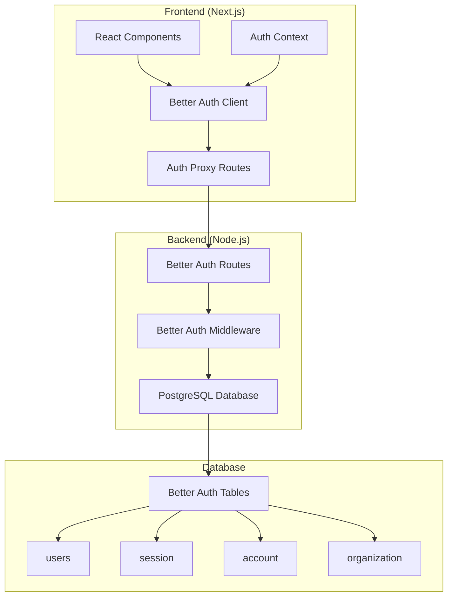

# Better Auth Migration Fix - Design Document

## Overview

This design addresses the critical authentication system issues caused by an incomplete NextAuth to Better Auth migration. The system currently has multiple authentication services running in parallel, causing conflicts and preventing proper user authentication. The design focuses on consolidating to a single Better Auth implementation while removing all NextAuth artifacts.

## Architecture

### Current State Analysis

**Problems Identified:**
1. **Multiple Auth Services**: Three different authentication services are active simultaneously:
   - `authService.ts` (legacy wrapper)
   - `api-auth-service.ts` (enhanced API service)
   - `better-auth-client.ts` (Better Auth implementation)

2. **Conflicting Endpoints**: Different services are calling different endpoints:
   - Legacy: `/api/auth/login`
   - Better Auth: `/api/better-auth/sign-in`
   - Proxy: `/api/auth/*` → `/api/better-auth/*`

3. **Session Management Conflicts**: Multiple session storage mechanisms:
   - localStorage tokens (legacy)
   - Better Auth session cookies
   - Mixed validation approaches

4. **Frontend Container Issues**: Authentication conflicts causing container instability

### Target Architecture



## Components and Interfaces

### 1. Unified Authentication Client

**File**: `frontend/src/lib/auth/auth-client.ts`
- Single authentication client using Better Auth
- Replaces all legacy authentication services
- Provides consistent API for all auth operations

```typescript
interface AuthClient {
  // Authentication
  signIn(credentials: SignInCredentials): Promise<AuthResult>
  signUp(data: SignUpData): Promise<AuthResult>
  signOut(): Promise<void>
  
  // Session Management
  getSession(): Promise<Session | null>
  useSession(): SessionHook
  
  // User Management
  updateProfile(data: ProfileData): Promise<User>
  changePassword(data: PasswordData): Promise<void>
}
```

### 2. Authentication Context Provider

**File**: `frontend/src/lib/auth/auth-context.tsx`
- React context for authentication state
- Provides session data to all components
- Handles automatic session refresh

```typescript
interface AuthContextValue {
  user: User | null
  session: Session | null
  isLoading: boolean
  isAuthenticated: boolean
  signIn: (credentials: SignInCredentials) => Promise<void>
  signOut: () => Promise<void>
  updateUser: (data: Partial<User>) => Promise<void>
}
```

### 3. Better Auth Configuration

**File**: `frontend/src/lib/auth/better-auth-config.ts`
- Centralized Better Auth configuration
- Environment-specific settings
- Plugin configuration (organization, 2FA)

### 4. Authentication Middleware

**File**: `backend/middleware/better-auth.js`
- Session validation middleware
- Role-based access control
- Request authentication

### 5. Better Auth Routes

**File**: `backend/routes/better-auth.js`
- Complete Better Auth API endpoints
- User registration and authentication
- Session management
- Profile management

## Data Models

### User Model
```typescript
interface User {
  id: string
  email: string
  firstName: string
  lastName: string
  role: UserRole
  isActive: boolean
  isVerified: boolean
  phone?: string
  createdAt: Date
  updatedAt: Date
  lastLoginAt?: Date
}
```

### Session Model
```typescript
interface Session {
  id: string
  userId: string
  expiresAt: Date
  ipAddress?: string
  userAgent?: string
  createdAt: Date
}
```

### Authentication Response
```typescript
interface AuthResult {
  success: boolean
  user?: User
  session?: Session
  error?: {
    code: string
    message: string
  }
}
```

## Error Handling

### Error Categories

1. **Authentication Errors**
   - Invalid credentials
   - Account locked/disabled
   - Email not verified

2. **Session Errors**
   - Session expired
   - Invalid session token
   - Session not found

3. **Network Errors**
   - Connection timeout
   - Server unavailable
   - Proxy errors

4. **Validation Errors**
   - Invalid input data
   - Missing required fields
   - Format validation failures

### Error Handling Strategy

```typescript
interface AuthError {
  code: string
  message: string
  userMessage: string
  details?: any
}

class AuthErrorHandler {
  static handleError(error: any, context?: string): AuthError
  static isRetryableError(error: AuthError): boolean
  static getRetryDelay(attempt: number): number
}
```

## Testing Strategy

### Unit Tests
- Authentication client methods
- Error handling functions
- Session management utilities
- Permission checking logic

### Integration Tests
- Complete authentication flow
- Session persistence across requests
- Role-based access control
- API endpoint integration

### End-to-End Tests
- User registration flow
- Login/logout functionality
- Session persistence across page refreshes
- Protected route access

### Test Scenarios

1. **Happy Path Tests**
   - Successful registration
   - Successful login
   - Session persistence
   - Successful logout

2. **Error Handling Tests**
   - Invalid credentials
   - Network failures
   - Session expiration
   - Server errors

3. **Security Tests**
   - Unauthorized access attempts
   - Session hijacking prevention
   - CSRF protection
   - XSS prevention

## Migration Strategy

### Phase 1: Service Consolidation
1. Create unified authentication client
2. Remove legacy authentication services
3. Update all imports to use new client
4. Test basic authentication flow

### Phase 2: Frontend Integration
1. Implement authentication context
2. Update all components to use context
3. Remove direct service calls
4. Test component integration

### Phase 3: Backend Cleanup
1. Ensure Better Auth routes are complete
2. Remove any NextAuth route handlers
3. Update middleware to use Better Auth only
4. Test backend integration

### Phase 4: Database Cleanup
1. Verify Better Auth tables exist
2. Remove any NextAuth-specific tables
3. Migrate any remaining user data
4. Test database operations

### Phase 5: Testing and Validation
1. Run comprehensive test suite
2. Test authentication flows manually
3. Verify session persistence
4. Test error scenarios

## Security Considerations

### Session Security
- HttpOnly cookies for session tokens
- Secure flag in production
- SameSite protection
- Session expiration handling

### Password Security
- Bcrypt hashing with salt
- Minimum password requirements
- Password change validation
- Reset token expiration

### API Security
- Rate limiting on auth endpoints
- CORS configuration
- Request validation
- SQL injection prevention

### Client Security
- XSS prevention
- CSRF protection
- Secure token storage
- Input sanitization

## Performance Considerations

### Session Management
- Efficient session lookup
- Session cleanup for expired tokens
- Connection pooling for database
- Caching for user permissions

### Client Performance
- Lazy loading of auth components
- Efficient re-renders with React context
- Optimized bundle size
- Service worker integration

### Network Optimization
- Request deduplication
- Automatic retry with backoff
- Connection reuse
- Compression support

## Monitoring and Logging

### Authentication Events
- Login attempts (success/failure)
- Registration events
- Session creation/destruction
- Password changes

### Security Events
- Failed authentication attempts
- Suspicious activity detection
- Session anomalies
- Permission violations

### Performance Metrics
- Authentication response times
- Session validation performance
- Database query performance
- Error rates and types

## Deployment Considerations

### Environment Configuration
- Production vs development settings
- Database connection strings
- Secret key management
- CORS origins configuration

### Container Health
- Health check endpoints
- Graceful shutdown handling
- Resource monitoring
- Log aggregation

### Rollback Strategy
- Database migration rollback
- Configuration rollback
- Service rollback procedures
- Data backup and restore