# Container Networking & Proxy System Overhaul - Design Document

## Overview

This design document outlines the comprehensive architecture for modernizing RevivaTech's container networking and proxy system. The solution transforms the current fragmented approach into a robust, maintainable system that follows Docker networking best practices while ensuring backward compatibility and zero-downtime migration.

**Key Design Principles:**
- **Container-native networking**: Services communicate via Docker service names internally
- **Environment-aware configuration**: Clear separation between internal and external URLs
- **Proxy-first architecture**: All client communications route through frontend proxy
- **Future-proof design**: System resilient to container name changes and scaling

## Architecture

### Current vs Target Architecture Comparison

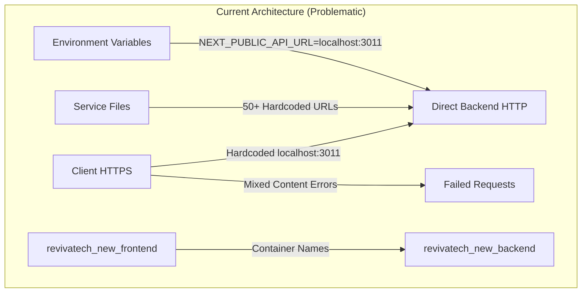

```mermaid
graph TB
    subgraph "Target Architecture (Solution)"
        A2[Client HTTPS] -->|Relative URLs| B2[Frontend Proxy]
        B2 -->|BACKEND_INTERNAL_URL| C2[revivatech_backend]
        D2[Service Files] -->|getApiUrl()| B2
        E2[revivatech_frontend] -->|Container Network| C2
        F2[Environment Variables] -->|Separated Internal/External| G2[Dynamic Resolution]
        C2 --> H2[revivatech_database]
        C2 --> I2[revivatech_redis]
    end
```

### System Architecture Overview

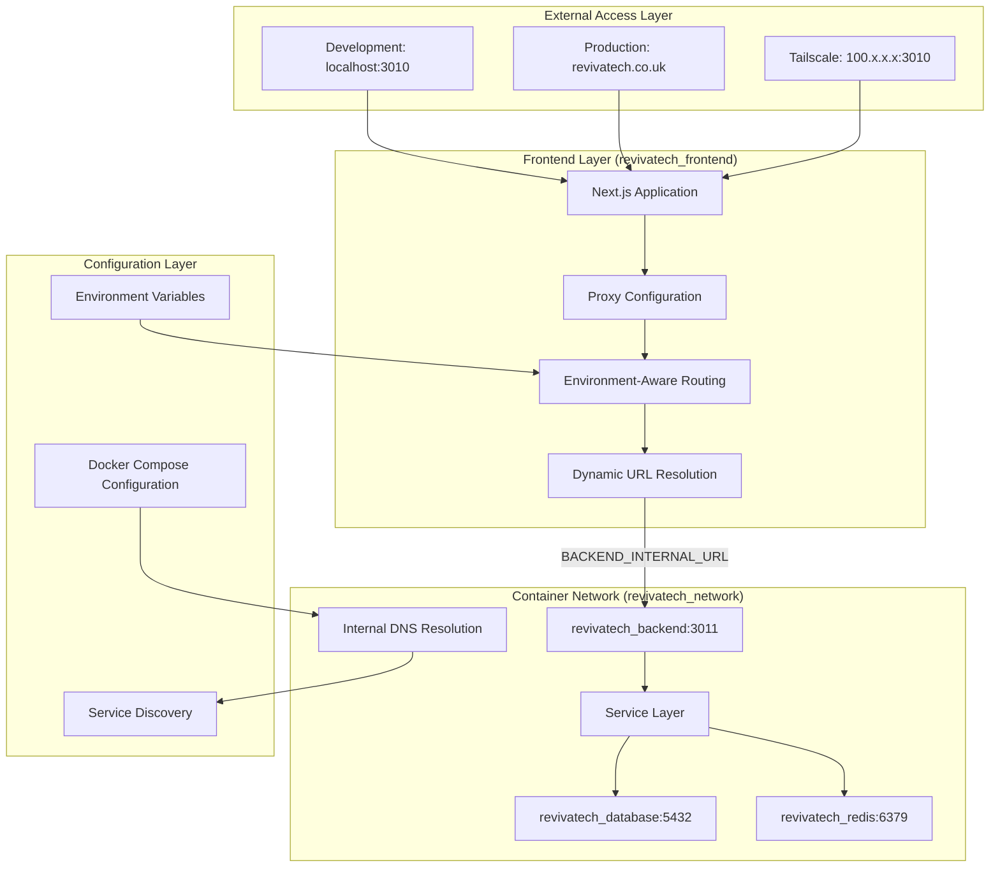

### Data Flow Architecture

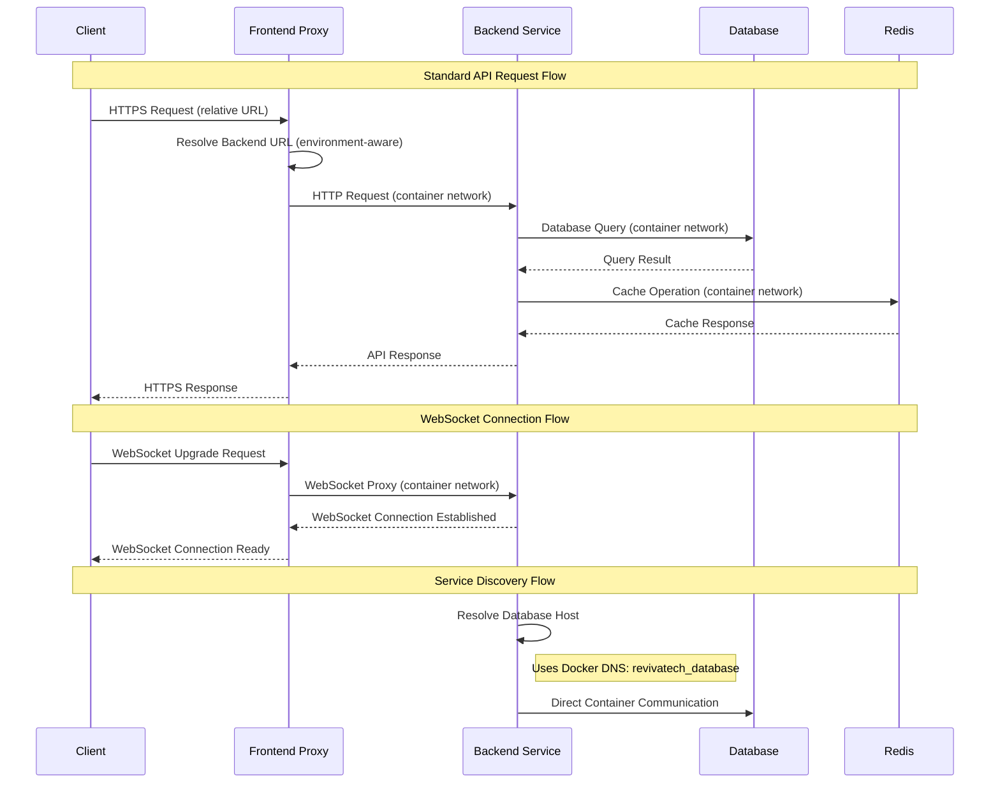

### Network Topology Design

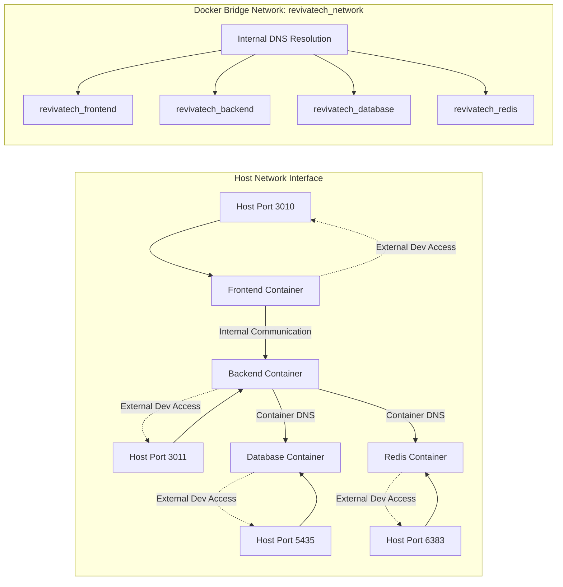

## Components and Interfaces

### 1. Environment Configuration Service

**Purpose:** Centralized URL resolution that adapts to different deployment environments and container networking scenarios.

**Interface Definition:**
```typescript
interface EnvironmentConfig {
  // Internal container communication URLs
  readonly BACKEND_INTERNAL_URL: string;
  readonly DATABASE_INTERNAL_HOST: string;
  readonly REDIS_INTERNAL_URL: string;
  
  // External access URLs (client-side)
  readonly NEXT_PUBLIC_API_URL?: string;
  readonly NEXT_PUBLIC_WEBSOCKET_URL?: string;
  readonly NEXT_PUBLIC_DOMAIN: string;
}

interface ApiUrlResolver {
  // Server-side URL resolution (internal container network)
  getInternalApiUrl(): string;
  
  // Client-side URL resolution (external access or proxy)
  getExternalApiUrl(): string;
  
  // Environment detection
  isServerSide(): boolean;
  isDevelopment(): boolean;
  isProduction(): boolean;
  
  // WebSocket URL resolution
  getWebSocketUrl(): string;
}

class EnvironmentAwareUrlResolver implements ApiUrlResolver {
  getInternalApiUrl(): string {
    if (typeof window === 'undefined') {
      // Server-side: use container networking
      return process.env.BACKEND_INTERNAL_URL || 'http://revivatech_backend:3011';
    }
    // Client-side: use relative URLs (proxy routing)
    return '';
  }
  
  getExternalApiUrl(): string {
    // Client-side external access
    const hostname = typeof window !== 'undefined' ? window.location.hostname : '';
    
    if (hostname.includes('revivatech.co.uk')) {
      return 'https://api.revivatech.co.uk';
    }
    
    // Development: use environment variable or proxy
    return process.env.NEXT_PUBLIC_API_URL || '';
  }
  
  getWebSocketUrl(): string {
    const protocol = typeof window !== 'undefined' 
      ? window.location.protocol === 'https:' ? 'wss:' : 'ws:'
      : 'ws:';
    
    const hostname = typeof window !== 'undefined' ? window.location.hostname : 'localhost';
    const port = this.isDevelopment() ? ':3011' : '';
    
    return `${protocol}//${hostname}${port}`;
  }
}
```

### 2. Proxy Configuration Interface

**Purpose:** Next.js proxy system that handles all API routing with environment-aware backend resolution.

**Interface Definition:**
```typescript
interface ProxyConfiguration {
  // Dynamic proxy routes based on environment
  getProxyRoutes(): ProxyRoute[];
  
  // Backend URL resolution for proxy destination
  resolveBackendUrl(): string;
  
  // Health check proxy routing
  getHealthCheckRoutes(): ProxyRoute[];
}

interface ProxyRoute {
  source: string;
  destination: string;
  permanent?: boolean;
}

class DynamicProxyConfig implements ProxyConfiguration {
  resolveBackendUrl(): string {
    return process.env.BACKEND_INTERNAL_URL || 'http://revivatech_backend:3011';
  }
  
  getProxyRoutes(): ProxyRoute[] {
    const backendUrl = this.resolveBackendUrl();
    
    return [
      {
        source: '/api/debug/:path*',
        destination: `${backendUrl}/api/debug/:path*`,
      },
      {
        source: '/api/auth/:path*',
        destination: `${backendUrl}/api/auth/:path*`,
      },
      {
        source: '/api/:path*',
        destination: `${backendUrl}/api/:path*`,
      }
    ];
  }
}
```

### 3. Service Discovery Interface

**Purpose:** Container network service discovery and health monitoring interface.

**Interface Definition:**
```typescript
interface ServiceDiscovery {
  // Container service resolution
  resolveService(serviceName: string): ServiceEndpoint;
  
  // Health checking for services
  checkServiceHealth(serviceName: string): Promise<HealthStatus>;
  
  // Service registration and deregistration
  registerService(service: ServiceDefinition): void;
  deregisterService(serviceName: string): void;
}

interface ServiceEndpoint {
  host: string;
  port: number;
  protocol: 'http' | 'https';
  healthCheckPath?: string;
}

interface ServiceDefinition {
  name: string;
  containerName: string;
  ports: PortMapping[];
  healthCheck: HealthCheckConfig;
}

enum HealthStatus {
  HEALTHY = 'healthy',
  UNHEALTHY = 'unhealthy',
  UNKNOWN = 'unknown'
}

class DockerComposeServiceDiscovery implements ServiceDiscovery {
  private services: Map<string, ServiceEndpoint> = new Map([
    ['backend', { host: 'revivatech_backend', port: 3011, protocol: 'http', healthCheckPath: '/health' }],
    ['database', { host: 'revivatech_database', port: 5432, protocol: 'http' }],
    ['redis', { host: 'revivatech_redis', port: 6379, protocol: 'http' }],
  ]);
  
  resolveService(serviceName: string): ServiceEndpoint {
    const service = this.services.get(serviceName);
    if (!service) {
      throw new Error(`Service ${serviceName} not found in service registry`);
    }
    return service;
  }
}
```

### 4. Migration Interface

**Purpose:** Safe container renaming and configuration migration with rollback capabilities.

**Interface Definition:**
```typescript
interface MigrationController {
  // Pre-migration validation
  validateMigrationReadiness(): Promise<MigrationValidation>;
  
  // Execute migration with rollback capability
  executeMigration(migrationPlan: MigrationPlan): Promise<MigrationResult>;
  
  // Rollback to previous state
  rollbackMigration(migrationId: string): Promise<RollbackResult>;
  
  // Post-migration validation
  validateMigrationSuccess(): Promise<ValidationResult>;
}

interface MigrationPlan {
  containerRenames: ContainerRename[];
  configurationUpdates: ConfigUpdate[];
  databaseMigrations: DatabaseMigration[];
  rollbackStrategy: RollbackStrategy;
}

interface ContainerRename {
  currentName: string;
  targetName: string;
  preserveVolumes: boolean;
  preserveNetworks: boolean;
}

interface ValidationResult {
  success: boolean;
  issues: ValidationIssue[];
  recommendations: string[];
}

enum MigrationStatus {
  PENDING = 'pending',
  IN_PROGRESS = 'in_progress',
  COMPLETED = 'completed',
  FAILED = 'failed',
  ROLLED_BACK = 'rolled_back'
}
```

## Database Design

Since this is primarily a networking and configuration overhaul, database schema changes are minimal. However, we need to ensure connection string compatibility:

### Connection Configuration Schema

```typescript
interface DatabaseConfiguration {
  // Internal container network configuration
  internal: {
    host: string; // 'revivatech_database'
    port: number; // 5432
    database: string;
    username: string;
    password: string;
    ssl: boolean;
  };
  
  // External development access configuration
  external: {
    host: string; // 'localhost'
    port: number; // 5435
    database: string;
    username: string;
    password: string;
    ssl: boolean;
  };
}

// Environment-aware connection string generator
class DatabaseConnectionManager {
  getConnectionString(useInternal: boolean = true): string {
    const config = useInternal ? this.config.internal : this.config.external;
    return `postgresql://${config.username}:${config.password}@${config.host}:${config.port}/${config.database}`;
  }
  
  // Connection pool configuration
  getPoolConfig(): PoolConfig {
    return {
      max: 20,
      min: 5,
      acquire: 30000,
      idle: 10000
    };
  }
}
```

### Configuration Migration Tracking

```sql
-- Track configuration changes and migrations
CREATE TABLE IF NOT EXISTS configuration_migrations (
    id UUID PRIMARY KEY DEFAULT gen_random_uuid(),
    migration_name VARCHAR(255) NOT NULL,
    migration_type VARCHAR(50) NOT NULL, -- 'container_rename', 'proxy_config', 'environment_update'
    status VARCHAR(50) NOT NULL DEFAULT 'pending',
    started_at TIMESTAMP WITH TIME ZONE DEFAULT CURRENT_TIMESTAMP,
    completed_at TIMESTAMP WITH TIME ZONE,
    rollback_data JSONB,
    error_message TEXT,
    created_by VARCHAR(100) DEFAULT 'system'
);

-- Index for migration tracking
CREATE INDEX idx_config_migrations_status ON configuration_migrations(status);
CREATE INDEX idx_config_migrations_type ON configuration_migrations(migration_type);
```

## Security Considerations

### Network Isolation Strategy

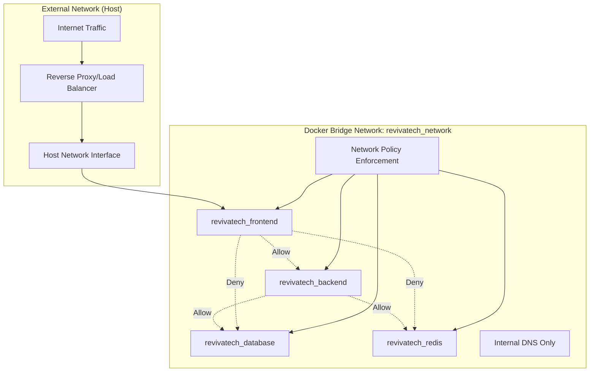

### Security Requirements Implementation

**Container Network Security:**
- [ ] All internal service communication uses encrypted connections where possible
- [ ] Database connections use connection pooling with timeout controls
- [ ] Redis connections implement authentication and connection limits
- [ ] Frontend container cannot directly access database or Redis
- [ ] Service-to-service communication logged for audit purposes

**Proxy Security:**
- [ ] All client requests validated and sanitized before proxying
- [ ] Rate limiting implemented at proxy layer
- [ ] Proxy headers sanitized to prevent header injection attacks
- [ ] CORS policies enforced at proxy level
- [ ] Request/response logging for security monitoring

**Environment Variable Security:**
```typescript
interface SecureConfigManager {
  // Secure environment variable handling
  getSecureValue(key: string): string | null;
  
  // Validation of configuration values
  validateConfiguration(): ConfigValidationResult;
  
  // Audit logging for configuration access
  auditConfigAccess(key: string, operation: 'read' | 'write'): void;
}

class ProductionConfigManager implements SecureConfigManager {
  private sensitiveKeys = [
    'DATABASE_PASSWORD',
    'JWT_SECRET', 
    'REDIS_PASSWORD',
    'SSL_PRIVATE_KEY_PATH'
  ];
  
  getSecureValue(key: string): string | null {
    const value = process.env[key];
    
    if (this.sensitiveKeys.includes(key)) {
      this.auditConfigAccess(key, 'read');
    }
    
    return value || null;
  }
}
```

### Access Control Matrix

| Service | Frontend | Backend | Database | Redis | External |
|---------|----------|---------|----------|-------|-----------|
| Frontend | - | HTTP:3011 | ❌ | ❌ | HTTPS:3010 |
| Backend | - | - | TCP:5432 | TCP:6379 | ❌ |
| Database | - | - | - | ❌ | TCP:5435* |
| Redis | - | - | - | - | TCP:6383* |

*External access only for development

## Error Handling

### Network Communication Error Handling

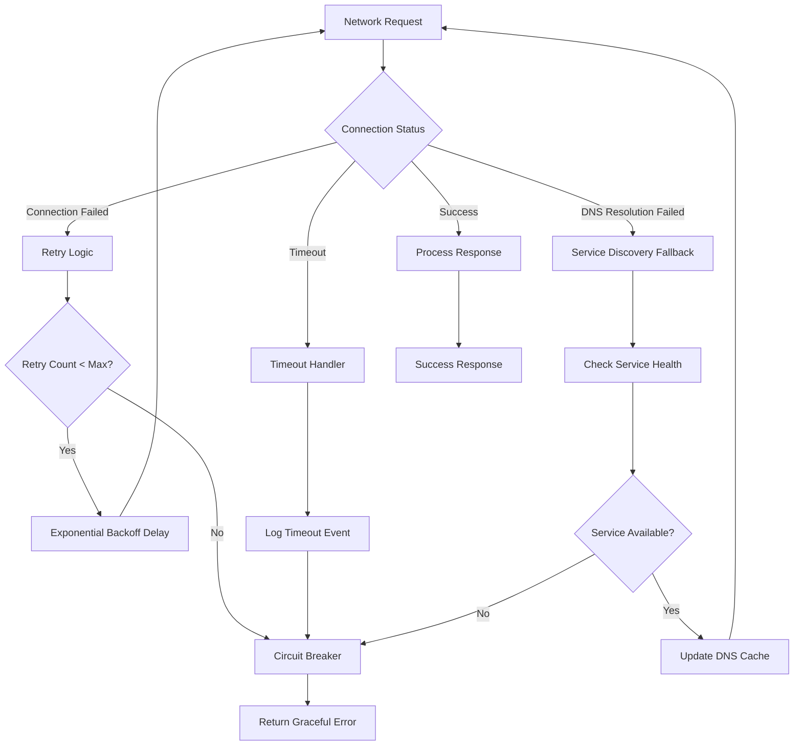

### Error Categories and Responses

```typescript
enum NetworkErrorType {
  CONNECTION_REFUSED = 'CONNECTION_REFUSED',
  TIMEOUT = 'TIMEOUT',
  DNS_RESOLUTION_FAILED = 'DNS_RESOLUTION_FAILED',
  PROXY_ERROR = 'PROXY_ERROR',
  CONTAINER_NOT_FOUND = 'CONTAINER_NOT_FOUND',
  CERTIFICATE_ERROR = 'CERTIFICATE_ERROR'
}

interface NetworkError {
  type: NetworkErrorType;
  message: string;
  service: string;
  timestamp: Date;
  retryable: boolean;
  context: {
    requestUrl: string;
    method: string;
    headers: Record<string, string>;
  };
}

class NetworkErrorHandler {
  handleError(error: NetworkError): ErrorHandlingStrategy {
    switch (error.type) {
      case NetworkErrorType.CONNECTION_REFUSED:
        return {
          action: 'retry',
          maxRetries: 3,
          backoffStrategy: 'exponential',
          fallbackResponse: this.getServiceUnavailableResponse()
        };
        
      case NetworkErrorType.DNS_RESOLUTION_FAILED:
        return {
          action: 'service_discovery',
          fallbackHosts: this.getAlternativeHosts(error.service),
          notifyServiceDiscovery: true
        };
        
      case NetworkErrorType.PROXY_ERROR:
        return {
          action: 'direct_connection',
          bypassProxy: true,
          auditLog: true
        };
        
      default:
        return {
          action: 'fail_fast',
          errorResponse: this.getGenericErrorResponse(error)
        };
    }
  }
}
```

### Service Health Monitoring

```typescript
interface ServiceHealthMonitor {
  monitorService(serviceName: string): void;
  getServiceStatus(serviceName: string): ServiceHealthStatus;
  notifyOnStatusChange(callback: (status: ServiceHealthStatus) => void): void;
}

interface ServiceHealthStatus {
  serviceName: string;
  status: 'healthy' | 'degraded' | 'unhealthy';
  lastCheckTime: Date;
  responseTime: number;
  errorRate: number;
  consecutiveFailures: number;
}

class DockerServiceHealthMonitor implements ServiceHealthMonitor {
  private readonly healthCheckInterval = 30000; // 30 seconds
  private readonly healthTimeout = 5000; // 5 seconds
  
  async checkServiceHealth(serviceName: string): Promise<ServiceHealthStatus> {
    const startTime = Date.now();
    
    try {
      const endpoint = this.serviceDiscovery.resolveService(serviceName);
      const response = await this.httpClient.get(
        `${endpoint.protocol}://${endpoint.host}:${endpoint.port}${endpoint.healthCheckPath}`,
        { timeout: this.healthTimeout }
      );
      
      return {
        serviceName,
        status: response.status === 200 ? 'healthy' : 'degraded',
        lastCheckTime: new Date(),
        responseTime: Date.now() - startTime,
        errorRate: 0,
        consecutiveFailures: 0
      };
      
    } catch (error) {
      return {
        serviceName,
        status: 'unhealthy',
        lastCheckTime: new Date(),
        responseTime: Date.now() - startTime,
        errorRate: 100,
        consecutiveFailures: this.getConsecutiveFailures(serviceName) + 1
      };
    }
  }
}
```

## Performance Considerations

### Network Performance Optimization

**Container Communication Optimization:**
- [ ] Docker bridge network configured for optimal MTU size
- [ ] Connection pooling implemented for all inter-service communication
- [ ] DNS caching configured for container name resolution
- [ ] Keep-alive connections used for frequent service communication

**Proxy Performance:**
```typescript
interface ProxyOptimization {
  // Connection pooling for backend requests
  connectionPool: {
    maxConnections: 100;
    keepAliveTimeout: 30000;
    keepAliveMsecs: 1000;
  };
  
  // Request caching strategy
  caching: {
    staticAssets: '1y';
    apiResponses: '5m';
    healthChecks: '30s';
  };
  
  // Load balancing (future)
  loadBalancing: {
    algorithm: 'round_robin';
    healthCheckInterval: 10000;
    failureThreshold: 3;
  };
}

class HighPerformanceProxy {
  private connectionPool: ConnectionPool;
  private cache: ResponseCache;
  
  async proxyRequest(request: IncomingRequest): Promise<ProxyResponse> {
    // Check cache first
    const cacheKey = this.generateCacheKey(request);
    const cached = await this.cache.get(cacheKey);
    if (cached) {
      return cached;
    }
    
    // Get pooled connection
    const connection = await this.connectionPool.acquire();
    
    try {
      const response = await this.forwardRequest(request, connection);
      
      // Cache response if appropriate
      if (this.isCacheable(request, response)) {
        await this.cache.set(cacheKey, response, this.getCacheTTL(request));
      }
      
      return response;
    } finally {
      this.connectionPool.release(connection);
    }
  }
}
```

### Performance Targets and Monitoring

**Key Performance Indicators:**
- **Container Startup Time**: < 30 seconds for all services
- **Inter-service Communication**: < 10ms latency within same host
- **Proxy Overhead**: < 5ms additional latency per request
- **DNS Resolution**: < 5ms for container name resolution
- **Connection Pool Efficiency**: > 90% connection reuse rate

**Performance Monitoring Setup:**
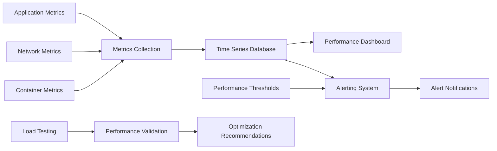

## Testing Strategy

### Container Networking Test Pyramid

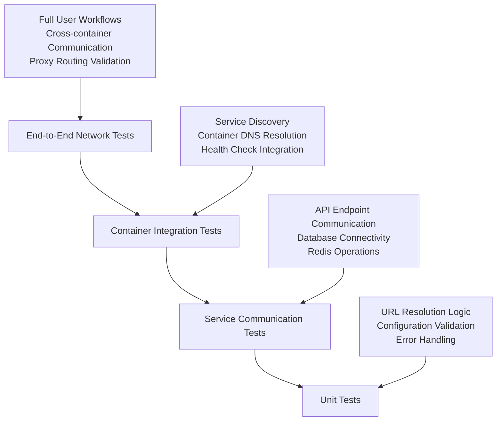

### Test Categories

**Unit Tests (URL Resolution & Configuration):**
```typescript
describe('EnvironmentAwareUrlResolver', () => {
  it('should return container URL for server-side requests', () => {
    // Mock server-side environment
    Object.defineProperty(global, 'window', { value: undefined });
    process.env.BACKEND_INTERNAL_URL = 'http://revivatech_backend:3011';
    
    const resolver = new EnvironmentAwareUrlResolver();
    expect(resolver.getInternalApiUrl()).toBe('http://revivatech_backend:3011');
  });
  
  it('should return relative URL for client-side requests', () => {
    // Mock client-side environment
    global.window = { location: { hostname: 'localhost' } } as any;
    
    const resolver = new EnvironmentAwareUrlResolver();
    expect(resolver.getInternalApiUrl()).toBe('');
  });
});
```

**Integration Tests (Service Communication):**
```bash
# Test container-to-container communication
docker-compose exec revivatech_frontend curl -f http://revivatech_backend:3011/health

# Test service discovery
docker-compose exec revivatech_backend nslookup revivatech_database

# Test proxy routing
curl -H "Host: localhost" http://localhost:3010/api/health
```

**End-to-End Tests (Complete Workflows):**
```typescript
describe('Complete User Workflows', () => {
  it('should handle authentication flow through new networking', async () => {
    // Test login through proxy
    const loginResponse = await fetch('/api/auth/login', {
      method: 'POST',
      headers: { 'Content-Type': 'application/json' },
      body: JSON.stringify({ email: 'test@example.com', password: 'password' })
    });
    
    expect(loginResponse.status).toBe(200);
    
    // Test authenticated API call
    const userResponse = await fetch('/api/user/profile');
    expect(userResponse.status).toBe(200);
  });
});
```

### Migration Testing Strategy

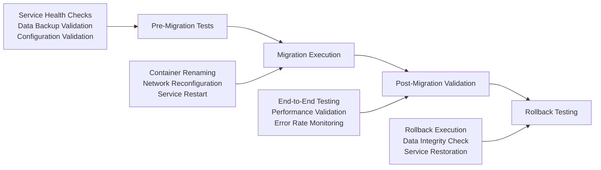

## Deployment Architecture

### Migration Deployment Strategy

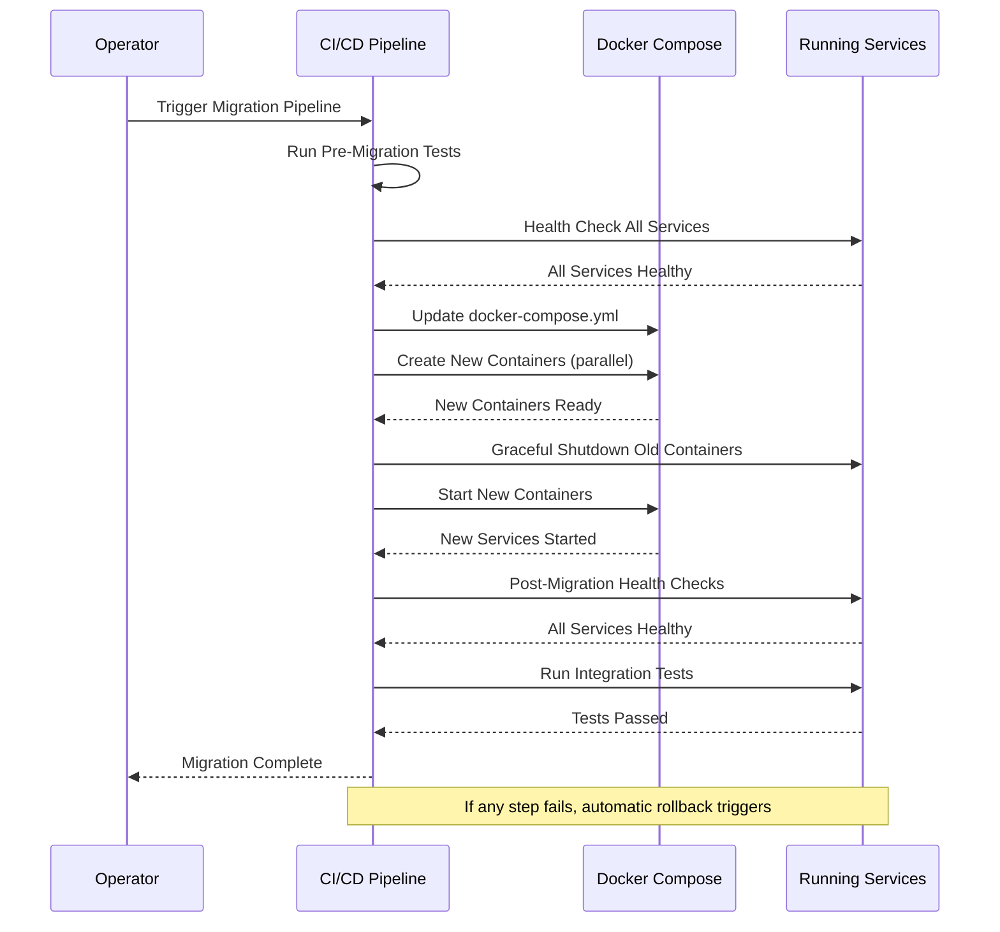

### Zero-Downtime Deployment Process

**Blue-Green Container Strategy:**
1. **Blue Environment**: Current running containers
2. **Green Environment**: New containers with updated configuration
3. **Traffic Switch**: Atomic switch from blue to green
4. **Validation**: Health checks and integration tests
5. **Cleanup**: Remove blue environment after validation

### Configuration Management

**Docker Compose Environment Variables:**
```yaml
# docker-compose.production.yml
version: '3.8'

services:
  revivatech_frontend:
    environment:
      - NODE_ENV=production
      - BACKEND_INTERNAL_URL=http://revivatech_backend:3011
      - NEXT_PUBLIC_API_URL=https://api.revivatech.co.uk
      - NEXT_PUBLIC_WEBSOCKET_URL=wss://api.revivatech.co.uk
    networks:
      - revivatech_network

  revivatech_backend:
    environment:
      - NODE_ENV=production
      - DATABASE_INTERNAL_HOST=revivatech_database
      - REDIS_INTERNAL_URL=redis://revivatech_redis:6379
    networks:
      - revivatech_network

networks:
  revivatech_network:
    driver: bridge
    name: revivatech_network
```

**Environment-Specific Configuration:**
```typescript
interface DeploymentConfig {
  environment: 'development' | 'staging' | 'production';
  containerNames: ContainerNameConfig;
  networkConfig: NetworkConfiguration;
  proxyConfig: ProxyConfiguration;
}

const deploymentConfigs: Record<string, DeploymentConfig> = {
  development: {
    environment: 'development',
    containerNames: {
      frontend: 'revivatech_frontend',
      backend: 'revivatech_backend',
      database: 'revivatech_database',
      redis: 'revivatech_redis'
    },
    networkConfig: {
      internalCommunication: true,
      externalPorts: [3010, 3011, 5435, 6383],
      dnsResolution: 'container'
    }
  },
  production: {
    environment: 'production',
    containerNames: {
      frontend: 'revivatech_frontend',
      backend: 'revivatech_backend',  
      database: 'revivatech_database',
      redis: 'revivatech_redis'
    },
    networkConfig: {
      internalCommunication: true,
      externalPorts: [3010], // Only frontend exposed
      dnsResolution: 'container'
    }
  }
};
```

## Monitoring and Logging

### Network Communication Monitoring

```typescript
interface NetworkMonitoring {
  // Request/response monitoring
  logRequest(request: NetworkRequest): void;
  logResponse(response: NetworkResponse): void;
  
  // Performance metrics
  recordLatency(service: string, operation: string, duration: number): void;
  recordThroughput(service: string, requestCount: number, timeWindow: number): void;
  
  // Error tracking
  recordNetworkError(error: NetworkError): void;
  recordServiceUnavailable(service: string, reason: string): void;
}

interface NetworkRequest {
  id: string;
  timestamp: Date;
  method: string;
  url: string;
  headers: Record<string, string>;
  body?: any;
  sourceService: string;
  targetService: string;
}

interface NetworkResponse {
  requestId: string;
  timestamp: Date;
  statusCode: number;
  headers: Record<string, string>;
  body?: any;
  duration: number;
}

class ComprehensiveNetworkMonitor implements NetworkMonitoring {
  private metricsCollector: MetricsCollector;
  private logger: Logger;
  
  logRequest(request: NetworkRequest): void {
    this.logger.info('Network Request', {
      requestId: request.id,
      method: request.method,
      url: request.url,
      source: request.sourceService,
      target: request.targetService,
      timestamp: request.timestamp
    });
    
    // Record metrics
    this.metricsCollector.increment('network.requests.total', {
      method: request.method,
      source: request.sourceService,
      target: request.targetService
    });
  }
  
  recordNetworkError(error: NetworkError): void {
    this.logger.error('Network Error', {
      type: error.type,
      service: error.service,
      message: error.message,
      context: error.context
    });
    
    this.metricsCollector.increment('network.errors.total', {
      type: error.type,
      service: error.service,
      retryable: error.retryable.toString()
    });
  }
}
```

### Container Health Monitoring

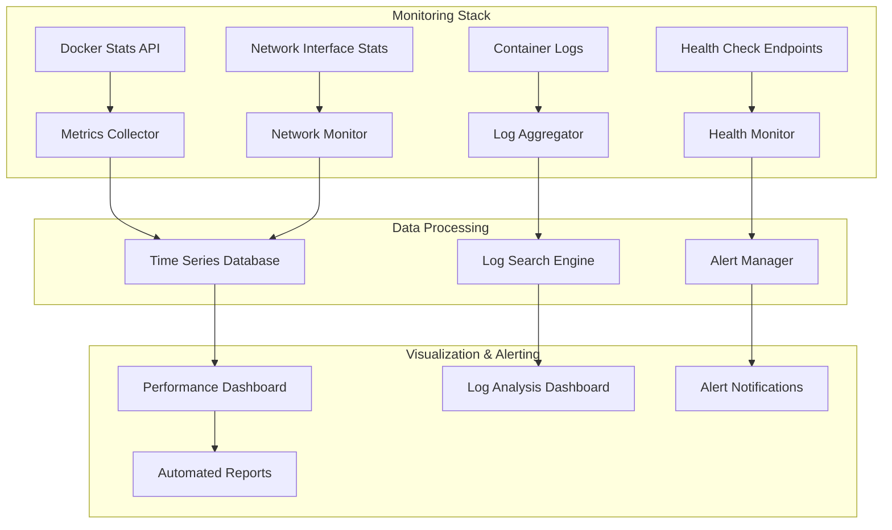

### Key Monitoring Metrics

**Container Performance Metrics:**
- CPU usage per container
- Memory usage and limits
- Network I/O per container
- Disk I/O and storage usage
- Container restart frequency

**Network Performance Metrics:**
- Request latency (p50, p95, p99)
- Throughput (requests per second)
- Error rates by service
- Connection pool utilization
- DNS resolution times

**Business Impact Metrics:**
- API availability percentage
- User-facing error rates
- Feature adoption through new networking
- Performance impact on user experience

---

**Document Version:** 1.0  
**Created:** August 14, 2025  
**Last Updated:** August 14, 2025  
**Author:** Claude Code Assistant  
**Technical Review:** Development Team Lead  
**Architecture Approval:** System Architecture Review Board