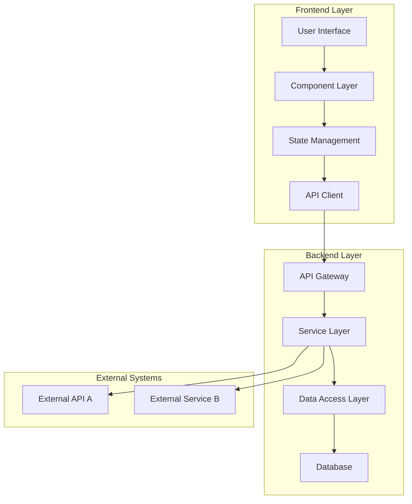
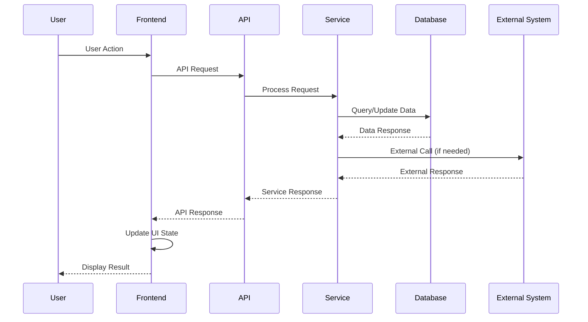
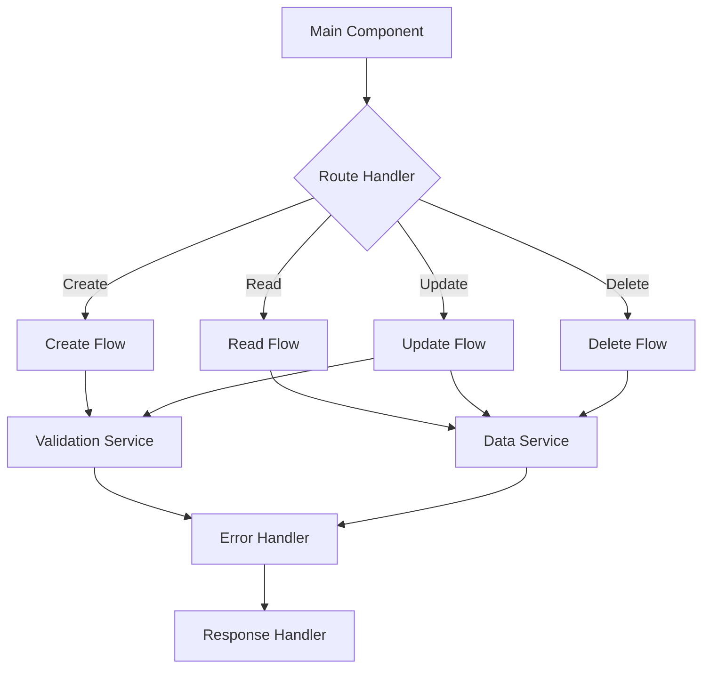
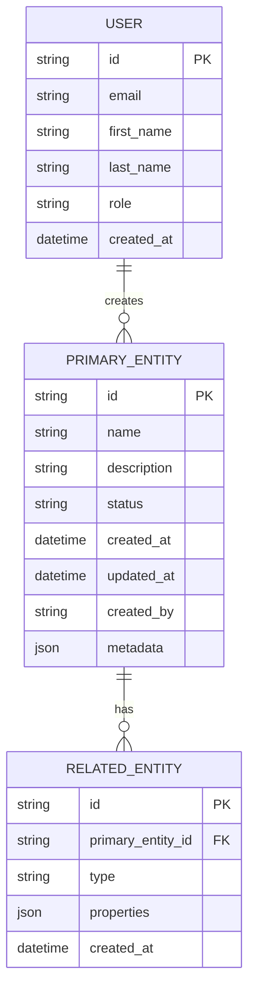
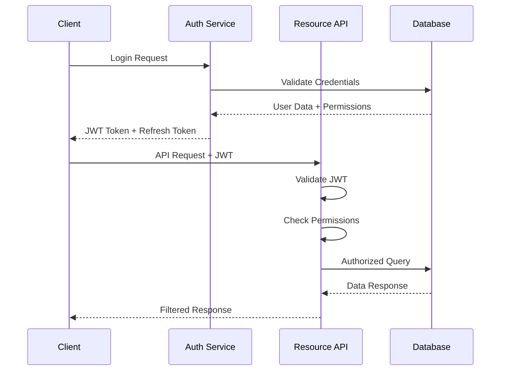
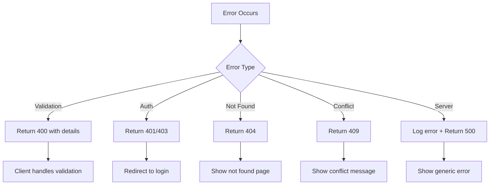
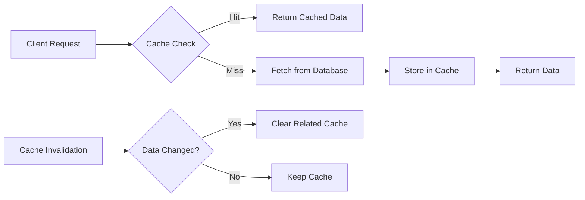
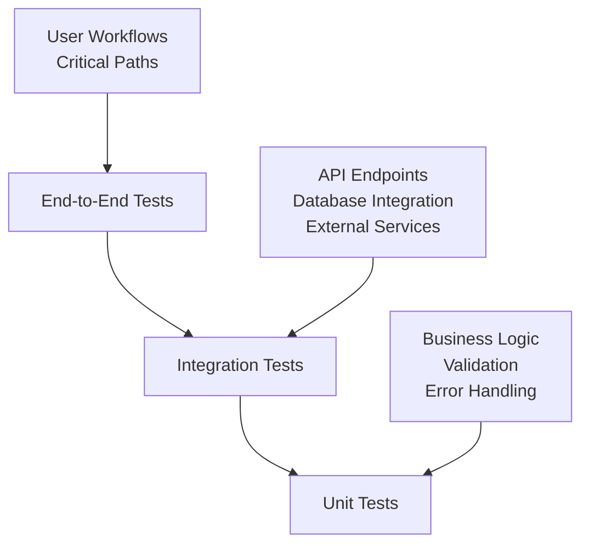
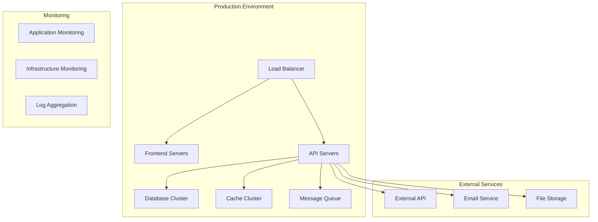
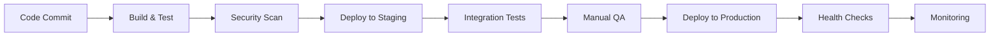

# [Feature Name] - Design Document

## Overview

[High-level description of the solution approach and design philosophy. Explain the key design decisions and how they address the requirements.]

## Architecture

### System Architecture Overview



### Data Flow Architecture



### Component Interaction Diagram



## Components and Interfaces

### 1. Core Service Interface

**Purpose:** [Description of the main service component and its responsibilities]

**Interface Definition:**
```typescript
interface CoreService {
  // Primary operations
  create(data: CreateData): Promise<CreateResult>;
  read(id: string): Promise<ReadResult>;
  update(id: string, data: UpdateData): Promise<UpdateResult>;
  delete(id: string): Promise<DeleteResult>;
  
  // Query operations
  list(filters?: FilterOptions): Promise<ListResult>;
  search(query: SearchQuery): Promise<SearchResult>;
  
  // Validation and utility
  validate(data: InputData): Promise<ValidationResult>;
  healthCheck(): Promise<HealthStatus>;
}

interface CreateData {
  [key: string]: any;
  // Define specific properties based on requirements
}

interface CreateResult {
  success: boolean;
  data?: CreatedEntity;
  error?: ServiceError;
  metadata?: OperationMetadata;
}
```

### 2. Data Models

**Primary Entity:**
```typescript
interface PrimaryEntity {
  id: string;
  name: string;
  description?: string;
  status: EntityStatus;
  createdAt: Date;
  updatedAt: Date;
  createdBy: string;
  metadata?: Record<string, any>;
}

enum EntityStatus {
  ACTIVE = 'active',
  INACTIVE = 'inactive',
  PENDING = 'pending',
  ARCHIVED = 'archived'
}
```

**Related Entities:**
```typescript
interface RelatedEntity {
  id: string;
  primaryEntityId: string;
  type: RelationType;
  properties: Record<string, any>;
  createdAt: Date;
}

interface AggregateData {
  entityCount: number;
  lastUpdated: Date;
  summary: EntitySummary;
}
```

### 3. API Contract

**REST Endpoints:**
```typescript
interface ApiEndpoints {
  // CRUD Operations
  'POST /api/entities': {
    request: CreateEntityRequest;
    response: EntityResponse;
  };
  
  'GET /api/entities/:id': {
    response: EntityResponse;
  };
  
  'PUT /api/entities/:id': {
    request: UpdateEntityRequest;
    response: EntityResponse;
  };
  
  'DELETE /api/entities/:id': {
    response: DeleteResponse;
  };
  
  // Query Operations
  'GET /api/entities': {
    query: ListQueryParams;
    response: EntityListResponse;
  };
  
  'POST /api/entities/search': {
    request: SearchRequest;
    response: SearchResponse;
  };
}

interface EntityResponse {
  success: boolean;
  data?: PrimaryEntity;
  error?: ApiError;
  metadata?: ResponseMetadata;
}
```

### 4. Frontend Components

**Main Component Structure:**
```typescript
interface ComponentProps {
  // Component-specific props
  entityId?: string;
  mode: 'create' | 'edit' | 'view';
  onSuccess?: (entity: PrimaryEntity) => void;
  onError?: (error: Error) => void;
}

interface ComponentState {
  entity: PrimaryEntity | null;
  loading: boolean;
  error: string | null;
  validationErrors: ValidationError[];
}

// React Component Interface
const MainComponent: React.FC<ComponentProps> = (props) => {
  // Component implementation
};
```

## Database Design

### Entity Relationship Diagram



### Database Schema

```sql
-- Primary entity table
CREATE TABLE primary_entities (
    id UUID PRIMARY KEY DEFAULT gen_random_uuid(),
    name VARCHAR(255) NOT NULL,
    description TEXT,
    status VARCHAR(50) NOT NULL DEFAULT 'active',
    created_at TIMESTAMP WITH TIME ZONE DEFAULT CURRENT_TIMESTAMP,
    updated_at TIMESTAMP WITH TIME ZONE DEFAULT CURRENT_TIMESTAMP,
    created_by UUID REFERENCES users(id),
    metadata JSONB DEFAULT '{}'
);

-- Indexes for performance
CREATE INDEX idx_primary_entities_status ON primary_entities(status);
CREATE INDEX idx_primary_entities_created_by ON primary_entities(created_by);
CREATE INDEX idx_primary_entities_created_at ON primary_entities(created_at);
CREATE INDEX idx_primary_entities_metadata ON primary_entities USING GIN(metadata);

-- Related entity table
CREATE TABLE related_entities (
    id UUID PRIMARY KEY DEFAULT gen_random_uuid(),
    primary_entity_id UUID REFERENCES primary_entities(id) ON DELETE CASCADE,
    type VARCHAR(100) NOT NULL,
    properties JSONB NOT NULL DEFAULT '{}',
    created_at TIMESTAMP WITH TIME ZONE DEFAULT CURRENT_TIMESTAMP
);
```

## Security Considerations

### Authentication and Authorization

**Authentication Flow:**


**Security Requirements:**
- [ ] All API endpoints require valid JWT authentication
- [ ] Role-based access control implemented for all operations
- [ ] Input validation and sanitization on all endpoints
- [ ] SQL injection prevention through parameterized queries
- [ ] XSS prevention through output encoding
- [ ] CSRF protection through token validation
- [ ] Rate limiting on sensitive endpoints
- [ ] Audit logging for all data modifications

### Data Protection
- [ ] Sensitive data encrypted at rest
- [ ] API communications over HTTPS only
- [ ] Personal data handling compliant with privacy regulations
- [ ] Data retention policies implemented
- [ ] Secure backup and recovery procedures

## Error Handling

### Error Categories and Responses

```typescript
interface ServiceError {
  code: string;
  message: string;
  details?: any;
  timestamp: Date;
  traceId?: string;
}

enum ErrorCode {
  // Validation Errors (400)
  INVALID_INPUT = 'INVALID_INPUT',
  MISSING_REQUIRED_FIELD = 'MISSING_REQUIRED_FIELD',
  VALIDATION_FAILED = 'VALIDATION_FAILED',
  
  // Authentication/Authorization (401/403)
  UNAUTHORIZED = 'UNAUTHORIZED',
  FORBIDDEN = 'FORBIDDEN',
  TOKEN_EXPIRED = 'TOKEN_EXPIRED',
  
  // Not Found (404)
  ENTITY_NOT_FOUND = 'ENTITY_NOT_FOUND',
  ENDPOINT_NOT_FOUND = 'ENDPOINT_NOT_FOUND',
  
  // Conflict (409)
  DUPLICATE_ENTITY = 'DUPLICATE_ENTITY',
  CONSTRAINT_VIOLATION = 'CONSTRAINT_VIOLATION',
  
  // Server Errors (500)
  INTERNAL_ERROR = 'INTERNAL_ERROR',
  DATABASE_ERROR = 'DATABASE_ERROR',
  EXTERNAL_SERVICE_ERROR = 'EXTERNAL_SERVICE_ERROR'
}
```

### Error Handling Strategy



## Performance Considerations

### Optimization Strategies

**Database Optimization:**
- [ ] Proper indexing on frequently queried columns
- [ ] Query optimization and execution plan analysis
- [ ] Connection pooling configuration
- [ ] Read replica usage for read-heavy operations

**Caching Strategy:**


**Performance Targets:**
- [ ] API response time < 500ms for 95th percentile
- [ ] Database query time < 100ms for 99th percentile
- [ ] Frontend page load time < 2 seconds
- [ ] Support for 1000+ concurrent users

### Monitoring and Alerting

**Key Metrics:**
- Response time percentiles (p50, p95, p99)
- Error rate percentage
- Database connection pool usage
- Memory and CPU utilization
- Cache hit ratio

**Alerting Thresholds:**
- Error rate > 5% over 5 minutes
- Response time p95 > 1 second
- Database connection pool > 80% utilization
- Memory usage > 85% of available

## Testing Strategy

### Testing Pyramid



### Test Categories

**Unit Tests:**
- [ ] Service layer business logic
- [ ] Data validation functions
- [ ] Error handling scenarios
- [ ] Utility functions
- [ ] Component render tests

**Integration Tests:**
- [ ] API endpoint functionality
- [ ] Database operations
- [ ] External service integration
- [ ] Authentication flows
- [ ] Permission validation

**End-to-End Tests:**
- [ ] Complete user workflows
- [ ] Cross-browser compatibility
- [ ] Mobile responsiveness
- [ ] Performance benchmarks
- [ ] Security vulnerability scanning

## Deployment Architecture

### Infrastructure Overview



### Deployment Pipeline



### Configuration Management

**Environment Variables:**
- Database connection strings
- External service API keys
- Feature flags
- Performance tuning parameters
- Security configuration

**Deployment Requirements:**
- [ ] Zero-downtime deployment capability
- [ ] Rollback mechanism within 5 minutes
- [ ] Health check endpoints for monitoring
- [ ] Configuration validation before deployment
- [ ] Database migration automation

## Monitoring and Logging

### Application Logging

**Log Levels and Categories:**
```typescript
interface LogEntry {
  timestamp: Date;
  level: 'ERROR' | 'WARN' | 'INFO' | 'DEBUG';
  category: 'API' | 'DATABASE' | 'AUTH' | 'BUSINESS' | 'PERFORMANCE';
  message: string;
  metadata?: Record<string, any>;
  traceId?: string;
  userId?: string;
}
```

**Key Events to Log:**
- [ ] All API requests and responses
- [ ] Authentication attempts (success/failure)
- [ ] Database queries and performance
- [ ] Business logic errors and warnings
- [ ] External service calls and responses
- [ ] User actions and system events

### Metrics and Dashboards

**Business Metrics:**
- User engagement metrics
- Feature adoption rates
- Error rates by feature
- Performance by user segment

**Technical Metrics:**
- System performance metrics
- Infrastructure utilization
- Security events and threats
- Application health indicators

---

**Document Version:** 1.0  
**Created:** [Date]  
**Last Updated:** [Date]  
**Author:** [Name/Team]  
**Technical Review:** [Reviewer Name]  
**Architecture Approval:** [Architect Name]