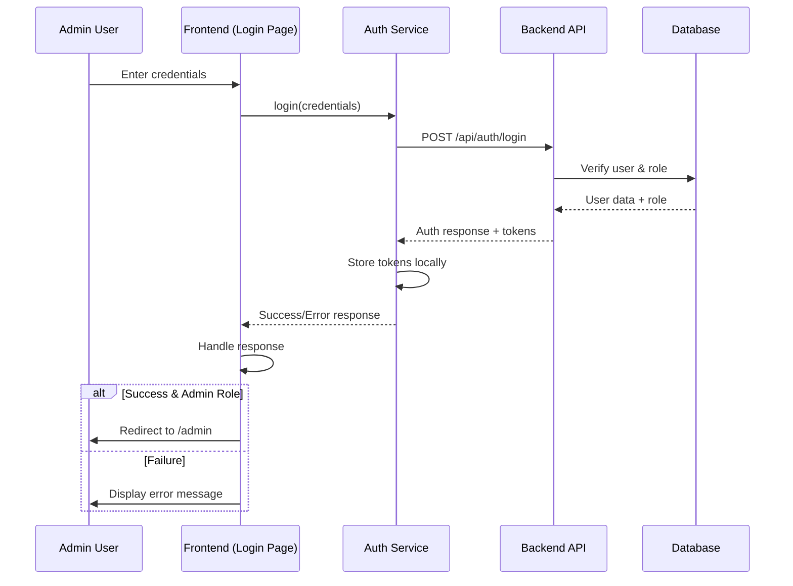
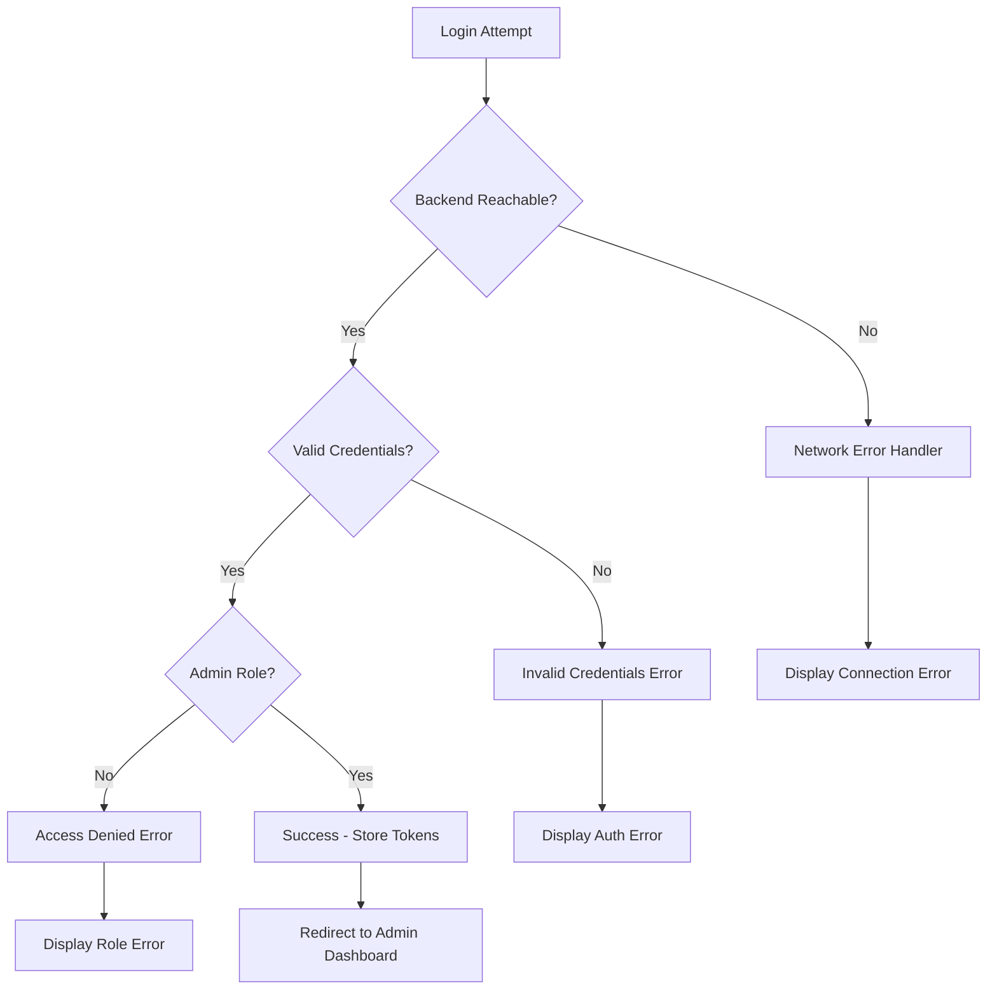

# Admin Login Fix - Design Document

## Overview

This design addresses the admin login failure issue by implementing a comprehensive diagnostic and repair approach. The solution focuses on identifying the root cause of authentication failures and implementing robust error handling, session management, and role verification for admin users.

## Architecture

### Authentication Flow Architecture



### Error Handling Flow



## Components and Interfaces

### 1. Authentication Diagnostic Service

**Purpose:** Diagnose authentication issues and provide detailed error reporting.

**Interface:**
```typescript
interface AuthDiagnosticService {
  // Test backend connectivity
  testBackendConnection(): Promise<DiagnosticResult>;
  
  // Test specific auth endpoint
  testAuthEndpoint(): Promise<DiagnosticResult>;
  
  // Verify admin user exists
  verifyAdminUser(email: string): Promise<DiagnosticResult>;
  
  // Run full diagnostic suite
  runFullDiagnostic(): Promise<DiagnosticReport>;
}

interface DiagnosticResult {
  success: boolean;
  message: string;
  details?: any;
  timestamp: Date;
}

interface DiagnosticReport {
  overall: 'PASS' | 'FAIL' | 'WARNING';
  results: DiagnosticResult[];
  recommendations: string[];
}
```

### 2. Enhanced Error Handler

**Purpose:** Provide user-friendly error messages and proper error categorization.

**Interface:**
```typescript
interface AuthErrorHandler {
  // Categorize and format errors
  handleAuthError(error: any): FormattedError;
  
  // Check if error is retryable
  isRetryableError(error: any): boolean;
  
  // Get user-friendly message
  getUserMessage(error: any): string;
}

interface FormattedError {
  type: 'NETWORK' | 'AUTH' | 'ROLE' | 'SERVER' | 'UNKNOWN';
  message: string;
  userMessage: string;
  retryable: boolean;
  details?: any;
}
```

### 3. Session Management Enhancement

**Purpose:** Improve token storage, refresh, and session validation.

**Interface:**
```typescript
interface EnhancedSessionManager {
  // Store tokens with metadata
  storeTokens(tokens: AuthTokens, userInfo: User): void;
  
  // Validate current session
  validateSession(): Promise<SessionValidationResult>;
  
  // Auto-refresh tokens
  refreshTokensIfNeeded(): Promise<boolean>;
  
  // Clear session data
  clearSession(): void;
}

interface SessionValidationResult {
  valid: boolean;
  user?: User;
  needsRefresh: boolean;
  error?: string;
}
```

### 4. Admin Role Validator

**Purpose:** Ensure proper role verification and access control.

**Interface:**
```typescript
interface AdminRoleValidator {
  // Check if user has admin privileges
  hasAdminRole(user: User): boolean;
  
  // Validate admin access for specific resource
  validateAdminAccess(user: User, resource: string): boolean;
  
  // Get admin permissions
  getAdminPermissions(user: User): AdminPermissions;
}

interface AdminPermissions {
  canAccessDashboard: boolean;
  canManageUsers: boolean;
  canViewAnalytics: boolean;
  canModifySettings: boolean;
}
```

## Data Models

### Enhanced Auth Response

```typescript
interface EnhancedAuthResponse<T = any> {
  success: boolean;
  data?: T;
  error?: {
    code: string;
    message: string;
    type: 'NETWORK' | 'AUTH' | 'ROLE' | 'SERVER' | 'VALIDATION';
    retryable: boolean;
    details?: any;
  };
  metadata?: {
    timestamp: Date;
    requestId: string;
    diagnostics?: DiagnosticResult[];
  };
}
```

### Session Storage Model

```typescript
interface StoredSession {
  tokens: AuthTokens;
  user: User;
  permissions: AdminPermissions;
  lastValidated: Date;
  expiresAt: Date;
  metadata: {
    loginTime: Date;
    userAgent: string;
    ipAddress?: string;
  };
}
```

## Error Handling

### Error Categories and Responses

1. **Network Errors**
   - Connection timeout
   - DNS resolution failure
   - Server unreachable
   - Response: "Connection error - please check your internet connection and try again"

2. **Authentication Errors**
   - Invalid credentials
   - User not found
   - Account locked
   - Response: "Invalid email or password"

3. **Authorization Errors**
   - Insufficient role
   - Access denied
   - Response: "Access denied. Admin privileges required."

4. **Server Errors**
   - Internal server error
   - Database connection failure
   - Response: "Server error - please try again later or contact support"

5. **Validation Errors**
   - Missing fields
   - Invalid format
   - Response: "Please fill in all required fields correctly"

### Error Recovery Strategies

1. **Automatic Retry**
   - Network timeouts: 3 retries with exponential backoff
   - Server errors (5xx): 2 retries with delay
   - Rate limiting: Wait and retry after specified time

2. **Fallback Mechanisms**
   - Local session validation when backend unavailable
   - Cached user data for offline scenarios
   - Graceful degradation of features

3. **User Guidance**
   - Clear error messages with actionable steps
   - Help links for common issues
   - Contact information for support

## Testing Strategy

### Unit Tests

1. **Authentication Service Tests**
   - Login flow with valid credentials
   - Login flow with invalid credentials
   - Token refresh mechanism
   - Error handling for various scenarios

2. **Diagnostic Service Tests**
   - Backend connectivity testing
   - Auth endpoint validation
   - User verification tests
   - Full diagnostic report generation

3. **Error Handler Tests**
   - Error categorization accuracy
   - User message generation
   - Retry logic validation

### Integration Tests

1. **End-to-End Login Flow**
   - Complete admin login process
   - Session management across page navigation
   - Logout and session cleanup

2. **API Integration Tests**
   - Backend authentication endpoint
   - Token refresh endpoint
   - User validation endpoint

3. **Error Scenario Tests**
   - Network failure simulation
   - Backend unavailability
   - Invalid response handling

### Manual Testing Scenarios

1. **Happy Path Testing**
   - Admin login with correct credentials
   - Navigation to admin dashboard
   - Session persistence across browser refresh

2. **Error Path Testing**
   - Login with incorrect credentials
   - Login when backend is down
   - Login with non-admin user
   - Rate limiting scenarios

3. **Security Testing**
   - Role-based access control
   - Token security validation
   - Session timeout handling

## Implementation Approach

### Phase 1: Diagnostic Implementation
1. Create diagnostic service to identify current issues
2. Implement comprehensive error logging
3. Add backend connectivity testing
4. Create diagnostic report UI for troubleshooting

### Phase 2: Error Handling Enhancement
1. Implement enhanced error categorization
2. Add user-friendly error messages
3. Create retry mechanisms for recoverable errors
4. Add error recovery strategies

### Phase 3: Session Management Improvement
1. Enhance token storage and validation
2. Implement automatic token refresh
3. Add session persistence across browser sessions
4. Create session cleanup mechanisms

### Phase 4: Role Verification Strengthening
1. Implement robust admin role checking
2. Add permission-based access control
3. Create role validation middleware
4. Add security event logging

### Phase 5: Testing and Validation
1. Comprehensive unit test coverage
2. Integration testing with backend
3. End-to-end testing scenarios
4. Security and performance testing

## Security Considerations

1. **Token Security**
   - Secure token storage (httpOnly cookies preferred)
   - Token encryption for sensitive data
   - Automatic token cleanup on logout

2. **Session Security**
   - Session timeout implementation
   - Concurrent session management
   - Session invalidation on role changes

3. **Error Information Disclosure**
   - Sanitized error messages to prevent information leakage
   - Detailed logging for administrators only
   - Rate limiting to prevent brute force attacks

4. **Admin Access Control**
   - Multi-factor authentication consideration
   - IP-based access restrictions
   - Audit logging for admin actions

## Performance Considerations

1. **Authentication Performance**
   - Token caching to reduce API calls
   - Lazy loading of user permissions
   - Optimized session validation

2. **Error Handling Performance**
   - Efficient error categorization
   - Minimal overhead for diagnostic checks
   - Asynchronous error reporting

3. **Network Optimization**
   - Request timeout configuration
   - Connection pooling for API calls
   - Retry backoff strategies