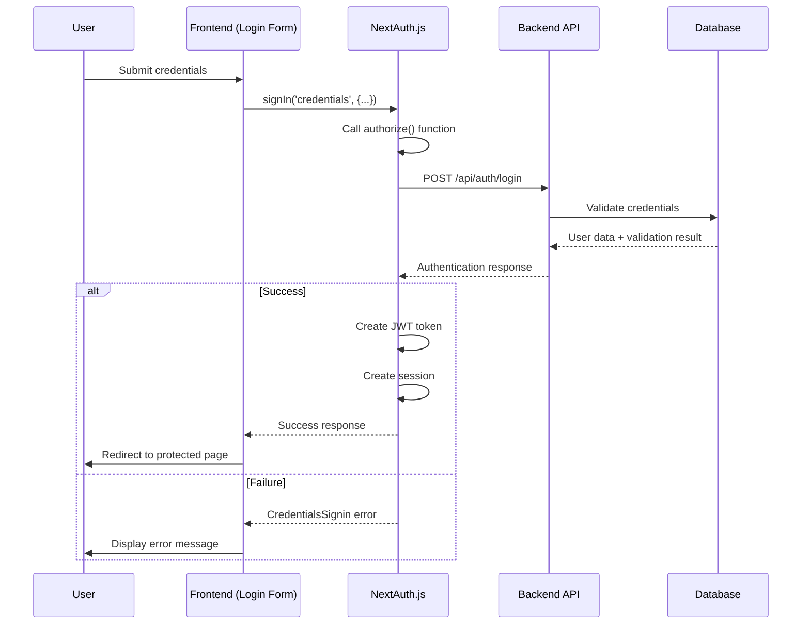
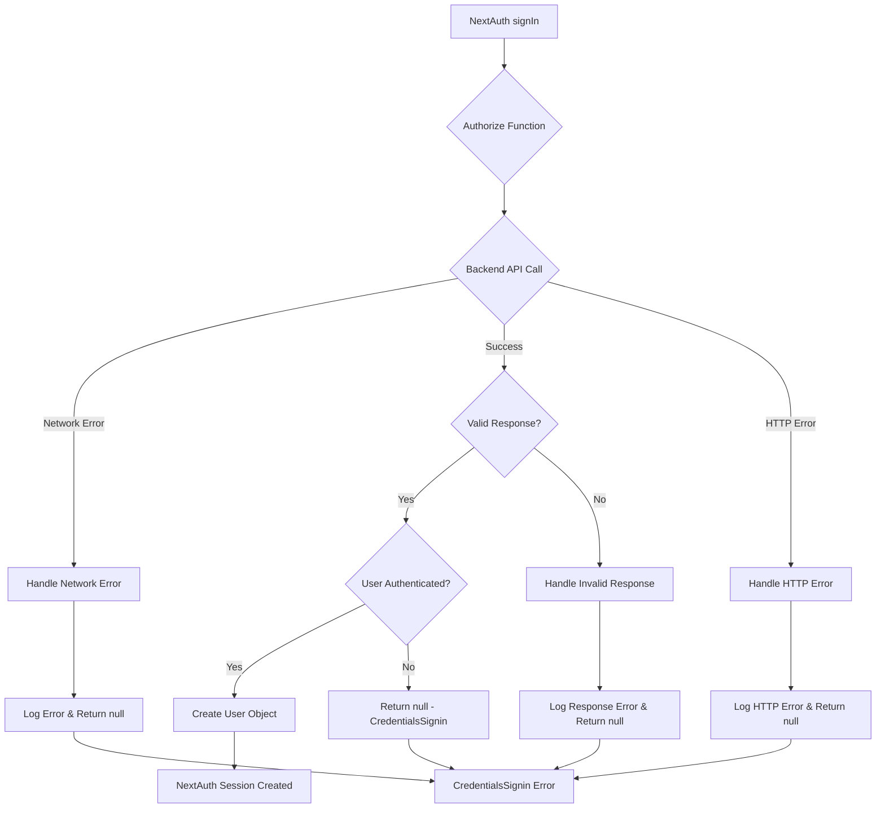

# NextAuth.js Credentials Authentication Fix - Design Document

## Overview

This design addresses the NextAuth.js "CredentialsSignin" error by implementing a comprehensive approach to diagnose and fix the credentials provider configuration. The solution focuses on ensuring proper integration between NextAuth.js and the backend authentication API, implementing robust error handling, and establishing reliable session management.

## Architecture

### NextAuth.js Authentication Flow



### Error Handling Flow



## Components and Interfaces

### 1. Enhanced NextAuth.js Configuration

**Purpose:** Provide a robust NextAuth.js configuration with proper error handling and debugging.

**Interface:**
```typescript
interface EnhancedNextAuthConfig extends NextAuthConfig {
  providers: [
    CredentialsProvider<{
      email: { label: string; type: string };
      password: { label: string; type: string };
    }>
  ];
  callbacks: {
    jwt: (params: { token: JWT; user?: User }) => Promise<JWT>;
    session: (params: { session: Session; token: JWT }) => Promise<Session>;
  };
  pages: {
    signIn: string;
    error: string;
  };
  debug: boolean;
  logger: NextAuthLogger;
}

interface NextAuthLogger {
  error: (code: string, metadata: any) => void;
  warn: (code: string) => void;
  debug: (code: string, metadata: any) => void;
}
```

### 2. Credentials Provider Authorize Function

**Purpose:** Handle the authentication logic between NextAuth.js and the backend API.

**Interface:**
```typescript
interface AuthorizeFunction {
  (
    credentials: Record<"email" | "password", string> | undefined,
    request: Pick<RequestInternal, "body" | "query" | "headers" | "method">
  ): Promise<User | null>;
}

interface BackendAuthResponse {
  success: boolean;
  data?: {
    user: {
      id: string;
      email: string;
      name: string;
      role: string;
    };
    token: string;
    refreshToken?: string;
  };
  error?: {
    message: string;
    code: string;
  };
}
```

### 3. NextAuth.js Error Handler

**Purpose:** Provide comprehensive error handling and logging for NextAuth.js operations.

**Interface:**
```typescript
interface NextAuthErrorHandler {
  // Handle authorize function errors
  handleAuthorizeError(error: any, credentials?: any): Promise<null>;
  
  // Log authentication attempts
  logAuthAttempt(email: string, success: boolean, error?: any): void;
  
  // Format errors for client consumption
  formatClientError(error: any): ClientAuthError;
}

interface ClientAuthError {
  type: 'CREDENTIALS_SIGNIN' | 'NETWORK_ERROR' | 'SERVER_ERROR' | 'INVALID_RESPONSE';
  message: string;
  retryable: boolean;
  details?: any;
}
```

### 4. Backend API Client for NextAuth.js

**Purpose:** Handle API communication between NextAuth.js and the backend authentication service.

**Interface:**
```typescript
interface NextAuthBackendClient {
  // Authenticate user credentials
  authenticate(email: string, password: string): Promise<BackendAuthResponse>;
  
  // Validate existing token
  validateToken(token: string): Promise<TokenValidationResponse>;
  
  // Refresh authentication token
  refreshToken(refreshToken: string): Promise<TokenRefreshResponse>;
}

interface TokenValidationResponse {
  valid: boolean;
  user?: User;
  error?: string;
}

interface TokenRefreshResponse {
  success: boolean;
  token?: string;
  refreshToken?: string;
  error?: string;
}
```

## Data Models

### NextAuth.js User Object

```typescript
interface NextAuthUser {
  id: string;
  email: string;
  name: string;
  role: string;
  permissions?: string[];
  lastLogin?: Date;
}
```

### NextAuth.js JWT Token

```typescript
interface NextAuthJWT {
  sub: string; // User ID
  email: string;
  name: string;
  role: string;
  permissions?: string[];
  backendToken?: string;
  refreshToken?: string;
  exp: number;
  iat: number;
}
```

### NextAuth.js Session

```typescript
interface NextAuthSession {
  user: {
    id: string;
    email: string;
    name: string;
    role: string;
    permissions?: string[];
  };
  expires: string;
  backendToken?: string;
}
```

## Error Handling

### NextAuth.js Error Categories

1. **CredentialsSignin Errors**
   - Invalid credentials provided
   - Backend authentication failure
   - Network connectivity issues
   - Response: Specific error based on failure type

2. **Configuration Errors**
   - Missing environment variables
   - Invalid provider configuration
   - Response: Configuration error with details

3. **Network Errors**
   - Backend API unreachable
   - Timeout errors
   - DNS resolution failures
   - Response: Network error with retry suggestion

4. **Server Errors**
   - Backend internal server errors
   - Database connection failures
   - Response: Server error with support contact

5. **Response Format Errors**
   - Invalid JSON response
   - Missing required fields
   - Unexpected response structure
   - Response: Invalid response error

### Error Recovery Strategies

1. **Automatic Retry Logic**
   - Network timeouts: 2 retries with exponential backoff
   - Server errors (5xx): 1 retry after delay
   - Rate limiting: Respect retry-after headers

2. **Fallback Mechanisms**
   - Graceful degradation when backend unavailable
   - Clear error messaging for user guidance
   - Logging for administrator troubleshooting

3. **Debug Information**
   - Detailed logging in development mode
   - Sanitized error messages in production
   - Request/response logging for troubleshooting

## Testing Strategy

### Unit Tests

1. **Authorize Function Tests**
   - Valid credentials authentication
   - Invalid credentials handling
   - Network error scenarios
   - Backend error responses

2. **Callback Function Tests**
   - JWT token creation and validation
   - Session object creation
   - Token refresh logic
   - Error handling in callbacks

3. **Error Handler Tests**
   - Error categorization accuracy
   - Client error formatting
   - Logging functionality

### Integration Tests

1. **NextAuth.js Flow Tests**
   - Complete authentication flow
   - Session management across requests
   - Token refresh mechanisms

2. **Backend Integration Tests**
   - API endpoint connectivity
   - Request/response format validation
   - Error response handling

3. **Frontend Integration Tests**
   - Login form submission
   - Error message display
   - Session state management

### Manual Testing Scenarios

1. **Happy Path Testing**
   - Successful login with valid credentials
   - Session persistence across page navigation
   - Proper logout functionality

2. **Error Path Testing**
   - Invalid credentials handling
   - Network failure scenarios
   - Backend unavailability
   - Malformed response handling

3. **Security Testing**
   - Token security validation
   - Session hijacking prevention
   - CSRF protection verification

## Implementation Approach

### Phase 1: NextAuth.js Configuration Enhancement
1. Review and fix NextAuth.js configuration
2. Implement proper credentials provider with authorize function
3. Add comprehensive error handling and logging
4. Configure proper callbacks for JWT and session

### Phase 2: Backend Integration Improvement
1. Create dedicated backend client for NextAuth.js
2. Implement proper request/response handling
3. Add network error handling and retries
4. Validate API endpoint accessibility

### Phase 3: Error Handling and Debugging
1. Implement comprehensive error categorization
2. Add detailed logging for troubleshooting
3. Create user-friendly error messages
4. Add debug mode for development

### Phase 4: Session Management Enhancement
1. Improve JWT token handling
2. Implement proper session callbacks
3. Add token refresh mechanisms
4. Ensure session persistence

### Phase 5: Testing and Validation
1. Comprehensive unit test coverage
2. Integration testing with backend
3. End-to-end authentication flow testing
4. Error scenario validation

## Security Considerations

1. **Credentials Handling**
   - Never log sensitive credentials
   - Secure transmission to backend API
   - Proper credential validation

2. **Token Security**
   - Secure JWT token generation
   - Proper token expiration handling
   - Secure token storage in sessions

3. **Session Security**
   - Secure session cookie configuration
   - Session timeout implementation
   - CSRF protection

4. **Error Information Disclosure**
   - Sanitized error messages in production
   - Detailed logging for administrators only
   - No sensitive information in client errors

## Performance Considerations

1. **Authentication Performance**
   - Efficient backend API calls
   - Minimal token validation overhead
   - Optimized session callbacks

2. **Error Handling Performance**
   - Fast error categorization
   - Minimal logging overhead
   - Efficient retry mechanisms

3. **Network Optimization**
   - Proper timeout configuration
   - Connection reuse for API calls
   - Efficient retry strategies

## Debugging and Monitoring

1. **Development Debugging**
   - NextAuth.js debug mode enabled
   - Detailed console logging
   - Request/response inspection

2. **Production Monitoring**
   - Error rate monitoring
   - Authentication success/failure metrics
   - Performance monitoring

3. **Troubleshooting Tools**
   - Authentication flow diagnostics
   - Backend connectivity testing
   - Session validation utilities