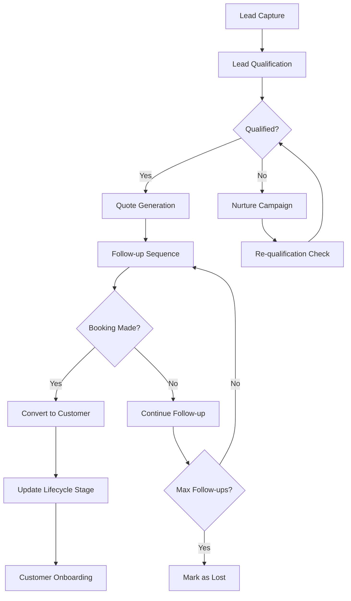
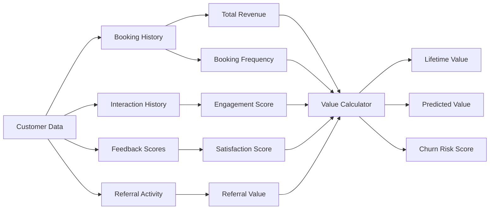
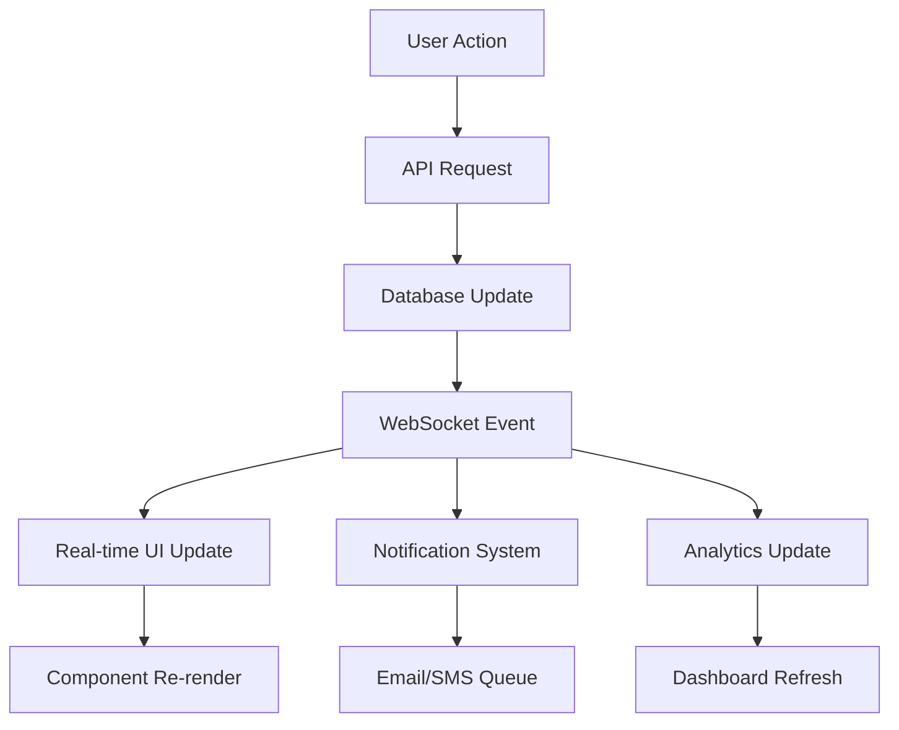

# RevivaTech CRM Foundation Architecture
## Phase 3 Implementation Specification

### Executive Summary

This document outlines the comprehensive Customer Relationship Management (CRM) foundation architecture for RevivaTech's Phase 3 implementation. The architecture builds upon the existing robust infrastructure while introducing advanced customer lifecycle management, lead tracking, segmentation, and business intelligence capabilities specifically designed for computer repair businesses.

---

## Table of Contents

1. [Current System Analysis](#current-system-analysis)
2. [Customer Lifecycle Definition](#customer-lifecycle-definition)
3. [Database Schema Extensions](#database-schema-extensions)
4. [API Endpoints Specification](#api-endpoints-specification)
5. [Component Architecture](#component-architecture)
6. [Data Flow Diagrams](#data-flow-diagrams)
7. [Business Intelligence Requirements](#business-intelligence-requirements)
8. [Integration Architecture](#integration-architecture)
9. [Implementation Roadmap](#implementation-roadmap)

---

## Current System Analysis

### Existing Strengths
- **User Management**: Robust authentication with roles (CUSTOMER, TECHNICIAN, ADMIN, SUPER_ADMIN)
- **Booking System**: Complete repair booking workflow with status tracking
- **Device Catalog**: Comprehensive device categories, brands, and models
- **Pricing Engine**: Dynamic pricing with rules and multipliers
- **Real-time Features**: WebSocket integration for live updates
- **Notification System**: Multi-channel notification delivery
- **Audit Logging**: Comprehensive action tracking

### Identified Gaps
- No lead management pipeline
- No customer lifecycle tracking
- No segmentation capabilities
- No customer interaction history beyond bookings
- No automated follow-up workflows
- No customer scoring/value tracking
- No referral management system
- Limited customer analytics

---

## Customer Lifecycle Definition

### 1. Lead Stage
**Definition**: Potential customers who have shown interest but haven't booked
- Initial contact through website forms
- Phone inquiries
- Walk-in consultations
- Marketing campaign responses

**Key Actions**:
- Lead capture and qualification
- Initial needs assessment
- Follow-up scheduling
- Quote generation

### 2. Prospect Stage  
**Definition**: Qualified leads with specific repair needs
- Detailed device assessment completed
- Quote provided
- Repair scope defined
- Decision timeline established

**Key Actions**:
- Quote follow-up campaigns
- Competitive analysis
- Objection handling
- Booking conversion

### 3. Customer Stage
**Definition**: Active customers with confirmed bookings
- Repair services booked
- Payment processed
- Service delivery in progress
- Customer onboarding complete

**Key Actions**:
- Service delivery management
- Progress updates
- Quality assurance
- Payment processing

### 4. Retention Stage
**Definition**: Customers post-service completion
- Repair completed successfully
- Satisfaction survey completed
- Warranty period active
- Potential for additional services

**Key Actions**:
- Satisfaction monitoring
- Warranty support
- Cross-sell opportunities
- Maintenance reminders

### 5. Advocacy Stage
**Definition**: Loyal customers who promote the business
- Multiple successful repairs
- High satisfaction scores
- Referral activity
- Positive reviews

**Key Actions**:
- Referral program management
- VIP customer benefits
- Testimonial collection
- Community building

---

## Database Schema Extensions

### New Tables

```sql
-- Customer Lifecycle Management
CREATE TABLE customer_lifecycle (
  id                    VARCHAR(36) PRIMARY KEY DEFAULT (UUID()),
  customer_id           VARCHAR(36) NOT NULL REFERENCES users(id),
  current_stage         ENUM('LEAD', 'PROSPECT', 'CUSTOMER', 'RETENTION', 'ADVOCACY') NOT NULL,
  stage_entered_at      TIMESTAMP NOT NULL DEFAULT NOW(),
  previous_stage        VARCHAR(20),
  lifecycle_score       DECIMAL(5,2) DEFAULT 0.00,
  estimated_value       DECIMAL(10,2) DEFAULT 0.00,
  next_action_due       TIMESTAMP,
  assigned_to           VARCHAR(36) REFERENCES users(id),
  created_at            TIMESTAMP DEFAULT NOW(),
  updated_at            TIMESTAMP DEFAULT NOW() ON UPDATE NOW(),
  
  INDEX idx_customer_stage (customer_id, current_stage),
  INDEX idx_stage_due (current_stage, next_action_due)
);

-- Lead Management
CREATE TABLE leads (
  id                    VARCHAR(36) PRIMARY KEY DEFAULT (UUID()),
  source_type           ENUM('WEBSITE', 'PHONE', 'WALK_IN', 'REFERRAL', 'SOCIAL', 'EMAIL', 'OTHER') NOT NULL,
  source_details        JSON,
  lead_score            DECIMAL(5,2) DEFAULT 0.00,
  qualification_status  ENUM('UNQUALIFIED', 'QUALIFYING', 'QUALIFIED', 'DISQUALIFIED') DEFAULT 'UNQUALIFIED',
  contact_info          JSON NOT NULL,
  device_interest       JSON,
  initial_needs         TEXT,
  budget_range          VARCHAR(50),
  urgency_level         ENUM('LOW', 'MEDIUM', 'HIGH', 'URGENT') DEFAULT 'MEDIUM',
  assigned_to           VARCHAR(36) REFERENCES users(id),
  converted_customer_id VARCHAR(36) REFERENCES users(id),
  converted_at          TIMESTAMP NULL,
  follow_up_count       INT DEFAULT 0,
  last_contact_at       TIMESTAMP,
  next_follow_up        TIMESTAMP,
  status                ENUM('ACTIVE', 'CONVERTED', 'LOST', 'UNRESPONSIVE') DEFAULT 'ACTIVE',
  lost_reason           VARCHAR(255),
  created_at            TIMESTAMP DEFAULT NOW(),
  updated_at            TIMESTAMP DEFAULT NOW() ON UPDATE NOW(),
  
  INDEX idx_lead_status (status, assigned_to),
  INDEX idx_lead_score (lead_score DESC),
  INDEX idx_follow_up (next_follow_up, status)
);

-- Customer Interactions
CREATE TABLE customer_interactions (
  id              VARCHAR(36) PRIMARY KEY DEFAULT (UUID()),
  customer_id     VARCHAR(36) NOT NULL REFERENCES users(id),
  interaction_type ENUM('CALL', 'EMAIL', 'SMS', 'CHAT', 'VISIT', 'BOOKING', 'PAYMENT', 'REVIEW', 'COMPLAINT', 'INQUIRY') NOT NULL,
  channel         ENUM('PHONE', 'EMAIL', 'WEBSITE', 'SOCIAL', 'IN_PERSON', 'SMS', 'CHAT') NOT NULL,
  direction       ENUM('INBOUND', 'OUTBOUND') NOT NULL,
  subject         VARCHAR(255),
  content         TEXT,
  metadata        JSON,
  staff_member_id VARCHAR(36) REFERENCES users(id),
  booking_id      VARCHAR(36) REFERENCES bookings(id),
  duration_minutes INT,
  outcome         VARCHAR(255),
  follow_up_required BOOLEAN DEFAULT FALSE,
  follow_up_date  TIMESTAMP NULL,
  sentiment       ENUM('POSITIVE', 'NEUTRAL', 'NEGATIVE') DEFAULT 'NEUTRAL',
  created_at      TIMESTAMP DEFAULT NOW(),
  
  INDEX idx_customer_interactions (customer_id, created_at DESC),
  INDEX idx_interaction_type (interaction_type, created_at DESC),
  INDEX idx_follow_up (follow_up_required, follow_up_date)
);

-- Customer Segmentation
CREATE TABLE customer_segments (
  id          VARCHAR(36) PRIMARY KEY DEFAULT (UUID()),
  name        VARCHAR(100) NOT NULL UNIQUE,
  description TEXT,
  criteria    JSON NOT NULL, -- Segmentation rules
  is_active   BOOLEAN DEFAULT TRUE,
  created_at  TIMESTAMP DEFAULT NOW(),
  updated_at  TIMESTAMP DEFAULT NOW() ON UPDATE NOW()
);

CREATE TABLE customer_segment_memberships (
  id           VARCHAR(36) PRIMARY KEY DEFAULT (UUID()),
  customer_id  VARCHAR(36) NOT NULL REFERENCES users(id),
  segment_id   VARCHAR(36) NOT NULL REFERENCES customer_segments(id),
  assigned_at  TIMESTAMP DEFAULT NOW(),
  
  UNIQUE KEY unique_customer_segment (customer_id, segment_id),
  INDEX idx_segment_customers (segment_id, assigned_at)
);

-- Customer Value Tracking
CREATE TABLE customer_value_metrics (
  id                    VARCHAR(36) PRIMARY KEY DEFAULT (UUID()),
  customer_id           VARCHAR(36) NOT NULL REFERENCES users(id),
  total_spent           DECIMAL(10,2) DEFAULT 0.00,
  total_bookings        INT DEFAULT 0,
  avg_booking_value     DECIMAL(10,2) DEFAULT 0.00,
  first_booking_date    TIMESTAMP,
  last_booking_date     TIMESTAMP,
  booking_frequency_days DECIMAL(8,2), -- Average days between bookings
  lifetime_value        DECIMAL(10,2) DEFAULT 0.00,
  predicted_value       DECIMAL(10,2) DEFAULT 0.00,
  satisfaction_score    DECIMAL(3,2), -- Average rating
  referral_count        INT DEFAULT 0,
  referral_value        DECIMAL(10,2) DEFAULT 0.00,
  churn_risk_score      DECIMAL(5,2) DEFAULT 0.00,
  last_calculated_at    TIMESTAMP DEFAULT NOW(),
  
  UNIQUE KEY unique_customer_metrics (customer_id),
  INDEX idx_lifetime_value (lifetime_value DESC),
  INDEX idx_churn_risk (churn_risk_score DESC)
);

-- Referral System
CREATE TABLE referrals (
  id                VARCHAR(36) PRIMARY KEY DEFAULT (UUID()),
  referrer_id       VARCHAR(36) NOT NULL REFERENCES users(id),
  referee_email     VARCHAR(255) NOT NULL,
  referee_id        VARCHAR(36) REFERENCES users(id), -- Set when referee registers
  referral_code     VARCHAR(20) UNIQUE NOT NULL,
  status            ENUM('PENDING', 'REGISTERED', 'CONVERTED', 'EXPIRED') DEFAULT 'PENDING',
  reward_type       ENUM('DISCOUNT', 'CREDIT', 'CASH', 'SERVICE') NOT NULL,
  reward_value      DECIMAL(10,2) NOT NULL,
  reward_claimed    BOOLEAN DEFAULT FALSE,
  reward_claimed_at TIMESTAMP NULL,
  converted_booking_id VARCHAR(36) REFERENCES bookings(id),
  expires_at        TIMESTAMP NOT NULL,
  created_at        TIMESTAMP DEFAULT NOW(),
  updated_at        TIMESTAMP DEFAULT NOW() ON UPDATE NOW(),
  
  INDEX idx_referrer (referrer_id, status),
  INDEX idx_referral_code (referral_code),
  INDEX idx_status_expiry (status, expires_at)
);

-- Marketing Campaigns
CREATE TABLE marketing_campaigns (
  id          VARCHAR(36) PRIMARY KEY DEFAULT (UUID()),
  name        VARCHAR(255) NOT NULL,
  type        ENUM('EMAIL', 'SMS', 'PUSH', 'SOCIAL', 'PRINT', 'RADIO', 'TV', 'ONLINE_AD') NOT NULL,
  status      ENUM('DRAFT', 'ACTIVE', 'PAUSED', 'COMPLETED', 'CANCELLED') DEFAULT 'DRAFT',
  target_segments JSON, -- Array of segment IDs
  content     JSON NOT NULL,
  schedule    JSON, -- Campaign scheduling details
  budget      DECIMAL(10,2),
  start_date  TIMESTAMP,
  end_date    TIMESTAMP,
  metrics     JSON, -- Campaign performance metrics
  created_by  VARCHAR(36) NOT NULL REFERENCES users(id),
  created_at  TIMESTAMP DEFAULT NOW(),
  updated_at  TIMESTAMP DEFAULT NOW() ON UPDATE NOW(),
  
  INDEX idx_campaign_status (status, start_date),
  INDEX idx_campaign_type (type, created_at DESC)
);

-- Customer Feedback
CREATE TABLE customer_feedback (
  id              VARCHAR(36) PRIMARY KEY DEFAULT (UUID()),
  customer_id     VARCHAR(36) NOT NULL REFERENCES users(id),
  booking_id      VARCHAR(36) REFERENCES bookings(id),
  feedback_type   ENUM('REVIEW', 'COMPLAINT', 'SUGGESTION', 'TESTIMONIAL', 'SURVEY') NOT NULL,
  rating          DECIMAL(2,1), -- 1.0 to 5.0
  title           VARCHAR(255),
  content         TEXT,
  source          ENUM('WEBSITE', 'EMAIL', 'PHONE', 'GOOGLE', 'FACEBOOK', 'TRUSTPILOT', 'IN_PERSON') NOT NULL,
  is_public       BOOLEAN DEFAULT FALSE,
  response        TEXT,
  responded_by    VARCHAR(36) REFERENCES users(id),
  responded_at    TIMESTAMP NULL,
  status          ENUM('NEW', 'IN_REVIEW', 'RESPONDED', 'RESOLVED', 'ESCALATED') DEFAULT 'NEW',
  priority        ENUM('LOW', 'MEDIUM', 'HIGH', 'URGENT') DEFAULT 'MEDIUM',
  created_at      TIMESTAMP DEFAULT NOW(),
  updated_at      TIMESTAMP DEFAULT NOW() ON UPDATE NOW(),
  
  INDEX idx_customer_feedback (customer_id, created_at DESC),
  INDEX idx_feedback_status (status, priority),
  INDEX idx_rating (rating, is_public)
);
```

### Schema Updates to Existing Tables

```sql
-- Extend users table for CRM
ALTER TABLE users ADD COLUMN (
  source_type         ENUM('WEBSITE', 'PHONE', 'WALK_IN', 'REFERRAL', 'SOCIAL', 'EMAIL', 'OTHER'),
  acquisition_date    TIMESTAMP,
  referral_code       VARCHAR(20),
  customer_notes      TEXT,
  preferred_contact   ENUM('EMAIL', 'PHONE', 'SMS') DEFAULT 'EMAIL',
  contact_frequency   ENUM('HIGH', 'MEDIUM', 'LOW') DEFAULT 'MEDIUM',
  marketing_consent   BOOLEAN DEFAULT FALSE,
  sms_consent         BOOLEAN DEFAULT FALSE,
  birthday           DATE,
  company            VARCHAR(255),
  job_title          VARCHAR(255),
  address            JSON,
  social_profiles    JSON,
  tags               JSON -- Array of customer tags
);

-- Extend bookings table for CRM tracking
ALTER TABLE bookings ADD COLUMN (
  lead_id                VARCHAR(36) REFERENCES leads(id),
  marketing_campaign_id  VARCHAR(36) REFERENCES marketing_campaigns(id),
  referral_id           VARCHAR(36) REFERENCES referrals(id),
  acquisition_cost      DECIMAL(10,2) DEFAULT 0.00,
  profit_margin         DECIMAL(5,2) DEFAULT 0.00,
  customer_effort_score DECIMAL(2,1), -- 1.0 to 5.0
  nps_score            INT, -- -100 to 100
  satisfaction_notes    TEXT
);
```

---

## API Endpoints Specification

### Lead Management Endpoints

```typescript
// Lead CRUD Operations
GET    /api/crm/leads                     // List leads with filtering
POST   /api/crm/leads                     // Create new lead
GET    /api/crm/leads/:id                 // Get lead details
PUT    /api/crm/leads/:id                 // Update lead
DELETE /api/crm/leads/:id                 // Delete lead

// Lead Actions
POST   /api/crm/leads/:id/qualify         // Mark lead as qualified
POST   /api/crm/leads/:id/convert         // Convert lead to customer
POST   /api/crm/leads/:id/schedule-follow-up // Schedule follow-up
POST   /api/crm/leads/:id/add-interaction // Add interaction record

// Lead Analytics
GET    /api/crm/leads/analytics/pipeline  // Lead pipeline analytics
GET    /api/crm/leads/analytics/sources   // Lead source analysis
GET    /api/crm/leads/analytics/conversion // Conversion metrics
```

### Customer Lifecycle Endpoints

```typescript
// Lifecycle Management
GET    /api/crm/customers/:id/lifecycle   // Get customer lifecycle status
PUT    /api/crm/customers/:id/lifecycle   // Update lifecycle stage
GET    /api/crm/customers/lifecycle/stats // Lifecycle distribution stats

// Customer Interactions
GET    /api/crm/customers/:id/interactions // Get customer interactions
POST   /api/crm/customers/:id/interactions // Add interaction
PUT    /api/crm/interactions/:id          // Update interaction
DELETE /api/crm/interactions/:id          // Delete interaction

// Customer Timeline
GET    /api/crm/customers/:id/timeline    // Complete customer timeline
```

### Segmentation Endpoints

```typescript
// Segment Management
GET    /api/crm/segments                  // List segments
POST   /api/crm/segments                  // Create segment
GET    /api/crm/segments/:id              // Get segment details
PUT    /api/crm/segments/:id              // Update segment
DELETE /api/crm/segments/:id              // Delete segment

// Segment Analytics
GET    /api/crm/segments/:id/customers    // Get segment customers
POST   /api/crm/segments/:id/refresh      // Refresh segment membership
GET    /api/crm/segments/analytics        // Segment performance analytics
```

### Customer Value Endpoints

```typescript
// Value Metrics
GET    /api/crm/customers/:id/value       // Customer value metrics
POST   /api/crm/customers/calculate-values // Bulk value calculation
GET    /api/crm/analytics/customer-value  // Value analytics dashboard

// Customer Scoring
POST   /api/crm/customers/:id/score       // Calculate customer score
GET    /api/crm/customers/high-value      // List high-value customers
GET    /api/crm/customers/at-risk         // List at-risk customers
```

### Referral Management Endpoints

```typescript
// Referral System
GET    /api/crm/referrals                 // List referrals
POST   /api/crm/referrals                 // Create referral
GET    /api/crm/referrals/:code/validate  // Validate referral code
POST   /api/crm/referrals/:id/claim       // Claim referral reward

// Referral Analytics
GET    /api/crm/referrals/analytics       // Referral program analytics
GET    /api/crm/customers/:id/referrals   // Customer's referral activity
```

### Marketing Campaign Endpoints

```typescript
// Campaign Management
GET    /api/crm/campaigns                 // List campaigns
POST   /api/crm/campaigns                 // Create campaign
GET    /api/crm/campaigns/:id             // Get campaign details
PUT    /api/crm/campaigns/:id             // Update campaign
DELETE /api/crm/campaigns/:id             // Delete campaign

// Campaign Execution
POST   /api/crm/campaigns/:id/launch      // Launch campaign
POST   /api/crm/campaigns/:id/pause       // Pause campaign
POST   /api/crm/campaigns/:id/stop        // Stop campaign

// Campaign Analytics
GET    /api/crm/campaigns/:id/analytics   // Campaign performance
GET    /api/crm/campaigns/analytics/roi   // ROI analysis
```

### Feedback Management Endpoints

```typescript
// Feedback Collection
GET    /api/crm/feedback                  // List feedback
POST   /api/crm/feedback                  // Create feedback
GET    /api/crm/feedback/:id              // Get feedback details
PUT    /api/crm/feedback/:id              // Update feedback
POST   /api/crm/feedback/:id/respond      // Respond to feedback

// Feedback Analytics
GET    /api/crm/feedback/analytics        // Feedback analytics
GET    /api/crm/feedback/sentiment        // Sentiment analysis
GET    /api/crm/customers/:id/feedback    // Customer feedback history
```

---

## Component Architecture

### Admin Dashboard Components

```typescript
// Main CRM Dashboard
/src/components/crm/
├── dashboard/
│   ├── CRMDashboard.tsx              // Main CRM overview
│   ├── CustomerLifecyclePipeline.tsx // Visual pipeline
│   ├── LeadMetrics.tsx               // Lead analytics
│   ├── CustomerValueMetrics.tsx      // Value analytics
│   └── RealtimeCRMStats.tsx          // Real-time statistics
│
├── leads/
│   ├── LeadManagement.tsx            // Lead list and management
│   ├── LeadDetails.tsx               // Individual lead view
│   ├── LeadQualification.tsx         // Qualification form
│   ├── LeadConversion.tsx            // Conversion workflow
│   └── LeadPipeline.tsx              // Visual pipeline
│
├── customers/
│   ├── CustomerProfile.tsx           // 360-degree customer view
│   ├── CustomerTimeline.tsx          // Interaction timeline
│   ├── CustomerSegments.tsx          // Segment management
│   ├── CustomerValue.tsx             // Value metrics display
│   └── CustomerLifecycle.tsx         // Lifecycle management
│
├── interactions/
│   ├── InteractionLog.tsx            // Interaction history
│   ├── InteractionForm.tsx           // Add new interaction
│   ├── InteractionTimeline.tsx       // Timeline view
│   └── InteractionAnalytics.tsx      // Interaction analytics
│
├── analytics/
│   ├── CRMAnalytics.tsx              // Main analytics dashboard
│   ├── CustomerValueAnalytics.tsx    // Value analysis
│   ├── SegmentAnalytics.tsx          // Segment performance
│   ├── CampaignAnalytics.tsx         // Marketing campaign ROI
│   └── PredictiveAnalytics.tsx       // Predictive modeling
│
├── campaigns/
│   ├── CampaignManager.tsx           // Campaign management
│   ├── CampaignBuilder.tsx           // Campaign creation
│   ├── CampaignMetrics.tsx           // Performance tracking
│   └── EmailTemplates.tsx            // Template management
│
├── feedback/
│   ├── FeedbackManager.tsx           // Feedback oversight
│   ├── ReviewManagement.tsx          // Review management
│   ├── SentimentAnalysis.tsx         // Sentiment tracking
│   └── ResponseTemplates.tsx         // Response templates
│
└── shared/
    ├── CustomerSearch.tsx            // Global customer search
    ├── SegmentBuilder.tsx            // Dynamic segment creation
    ├── ValueCalculator.tsx           // Value calculation tools
    └── CRMFilters.tsx                // Advanced filtering
```

### Component Specifications

#### CRMDashboard.tsx
```typescript
interface CRMDashboardProps {
  timeRange: 'day' | 'week' | 'month' | 'quarter' | 'year';
  segments?: string[];
  realtime?: boolean;
}

interface CRMMetrics {
  totalCustomers: number;
  activeLeads: number;
  conversionRate: number;
  customerLifetimeValue: number;
  churnRate: number;
  npsScore: number;
  revenueGrowth: number;
  segmentDistribution: SegmentMetric[];
}
```

#### CustomerProfile.tsx
```typescript
interface CustomerProfileProps {
  customerId: string;
  editable?: boolean;
  showFullHistory?: boolean;
}

interface CustomerData {
  personal: CustomerPersonalInfo;
  lifecycle: CustomerLifecycleInfo;
  value: CustomerValueMetrics;
  interactions: CustomerInteraction[];
  bookings: Booking[];
  feedback: CustomerFeedback[];
  referrals: Referral[];
  segments: CustomerSegment[];
  timeline: TimelineEvent[];
}
```

#### LeadPipeline.tsx
```typescript
interface LeadPipelineProps {
  userId?: string; // Filter by assigned user
  dateRange?: DateRange;
  stages: PipelineStage[];
}

interface PipelineStage {
  id: string;
  name: string;
  leads: Lead[];
  value: number;
  conversionRate: number;
  averageTime: number; // Days in stage
}
```

---

## Data Flow Diagrams

### 1. Lead to Customer Conversion Flow



### 2. Customer Value Calculation Flow



### 3. Real-time CRM Updates Flow



---

## Business Intelligence Requirements

### Key Performance Indicators (KPIs)

#### Lead Management KPIs
- **Lead Conversion Rate**: Percentage of leads converted to customers
- **Lead Response Time**: Average time to first contact
- **Lead Source ROI**: Revenue per lead source
- **Lead Velocity**: Time from lead to conversion
- **Cost Per Lead**: Marketing spend per generated lead
- **Lead Quality Score**: Qualification rate by source

#### Customer Lifecycle KPIs
- **Customer Acquisition Cost (CAC)**: Total cost to acquire a customer
- **Customer Lifetime Value (CLV)**: Predicted total customer value
- **CLV:CAC Ratio**: Profitability ratio
- **Churn Rate**: Percentage of customers lost per period
- **Retention Rate**: Percentage of customers retained
- **Upsell/Cross-sell Rate**: Additional service adoption

#### Customer Satisfaction KPIs
- **Net Promoter Score (NPS)**: Customer advocacy measurement
- **Customer Satisfaction Score (CSAT)**: Service satisfaction rating
- **Customer Effort Score (CES)**: Ease of service experience
- **Response Time**: Average customer service response time
- **Resolution Rate**: First-contact resolution percentage
- **Complaint Resolution Time**: Average time to resolve issues

#### Revenue KPIs
- **Monthly Recurring Revenue (MRR)**: Predictable monthly income
- **Average Order Value (AOV)**: Average booking value
- **Revenue Growth Rate**: Month-over-month growth
- **Profit Margin per Customer**: Profitability analysis
- **Referral Revenue**: Revenue from referral program
- **Segment Revenue**: Revenue by customer segment

### Analytics Data Points to Collect

#### Customer Behavior Analytics
```typescript
interface CustomerBehaviorData {
  websiteActivity: {
    pageViews: PageView[];
    sessionDuration: number;
    bounceRate: number;
    conversionPages: string[];
  };
  servicePreferences: {
    preferredDeviceTypes: string[];
    commonRepairTypes: string[];
    urgencyPatterns: string[];
    communicationPreferences: string[];
  };
  engagementMetrics: {
    emailOpenRate: number;
    clickThroughRate: number;
    responseRate: number;
    socialEngagement: number;
  };
}
```

#### Operational Analytics
```typescript
interface OperationalData {
  serviceMetrics: {
    averageRepairTime: number;
    firstTimeFixRate: number;
    warrantyClaimRate: number;
    technicianEfficiency: number[];
  };
  inventoryMetrics: {
    partsUsage: PartUsage[];
    stockTurnover: number;
    orderAccuracy: number;
  };
  financialMetrics: {
    revenueByService: ServiceRevenue[];
    profitMargins: ProfitMargin[];
    costStructure: CostBreakdown;
  };
}
```

### Reporting Capabilities

#### Executive Dashboard Reports
- Revenue and profitability trends
- Customer acquisition and retention metrics
- Market share and competitive analysis
- ROI on marketing investments
- Operational efficiency metrics

#### Operational Reports
- Daily/weekly/monthly booking summaries
- Technician performance reports
- Customer satisfaction trends
- Inventory and parts utilization
- Quality assurance metrics

#### Customer Reports
- Customer segmentation analysis
- Customer journey mapping
- Retention and churn analysis
- Referral program performance
- Customer feedback analysis

#### Predictive Analytics Reports
- Customer churn prediction
- Revenue forecasting
- Demand planning
- Customer lifetime value prediction
- Market trend analysis

---

## Integration Architecture

### Existing System Integration Points

#### Authentication System Integration
```typescript
// Extend existing AuthContext for CRM permissions
interface CRMPermissions {
  leads: {
    view: boolean;
    create: boolean;
    edit: boolean;
    delete: boolean;
    assign: boolean;
  };
  customers: {
    viewAll: boolean;
    viewOwn: boolean;
    editProfile: boolean;
    viewSensitive: boolean;
  };
  analytics: {
    viewReports: boolean;
    exportData: boolean;
    configureDashboards: boolean;
  };
}
```

#### Booking System Integration
```typescript
// CRM hooks into existing booking workflow
interface BookingCRMIntegration {
  onBookingCreated: (booking: Booking) => void;
  onStatusChanged: (booking: Booking, oldStatus: string) => void;
  onPaymentProcessed: (booking: Booking, payment: Payment) => void;
  onCompletionRated: (booking: Booking, rating: Rating) => void;
}
```

#### Notification System Integration
```typescript
// Extend existing notification system
interface CRMNotificationTypes {
  LEAD_ASSIGNED: 'lead_assigned';
  FOLLOW_UP_DUE: 'follow_up_due';
  CUSTOMER_MILESTONE: 'customer_milestone';
  CAMPAIGN_RESULT: 'campaign_result';
  FEEDBACK_RECEIVED: 'feedback_received';
  CHURN_RISK_ALERT: 'churn_risk_alert';
}
```

### External Integration Requirements

#### Email Marketing Integration
```typescript
interface EmailMarketingAdapter {
  provider: 'mailchimp' | 'sendgrid' | 'constant_contact';
  sync: {
    exportCustomers: (segment: CustomerSegment) => Promise<void>;
    importCampaignResults: (campaignId: string) => Promise<CampaignMetrics>;
    syncUnsubscribes: () => Promise<void>;
  };
}
```

#### Social Media Integration
```typescript
interface SocialMediaAdapter {
  platforms: ('facebook' | 'google' | 'trustpilot')[];
  actions: {
    importReviews: () => Promise<Review[]>;
    syncRatings: () => Promise<void>;
    postUpdates: (content: SocialPost) => Promise<void>;
  };
}
```

#### Accounting System Integration
```typescript
interface AccountingAdapter {
  provider: 'quickbooks' | 'xero' | 'freshbooks';
  sync: {
    exportInvoices: (period: DateRange) => Promise<void>;
    importPayments: () => Promise<Payment[]>;
    syncCustomerData: () => Promise<void>;
  };
}
```

---

## Implementation Roadmap

### Phase 3.1: Foundation (Weeks 1-2)
- [ ] Database schema implementation
- [ ] Basic API endpoints for leads and lifecycle
- [ ] Core CRM dashboard components
- [ ] Lead capture forms and qualification workflow

### Phase 3.2: Customer Management (Weeks 3-4)
- [ ] Customer profile 360-degree view
- [ ] Interaction tracking system
- [ ] Customer value calculation engine
- [ ] Basic segmentation functionality

### Phase 3.3: Analytics & Insights (Weeks 5-6)
- [ ] CRM analytics dashboard
- [ ] KPI tracking and reporting
- [ ] Customer lifecycle visualization
- [ ] Basic predictive analytics

### Phase 3.4: Marketing Automation (Weeks 7-8)
- [ ] Campaign management system
- [ ] Email marketing integration
- [ ] Automated follow-up workflows
- [ ] Referral program implementation

### Phase 3.5: Advanced Features (Weeks 9-10)
- [ ] Advanced segmentation engine
- [ ] Predictive churn modeling
- [ ] Social media integration
- [ ] Advanced reporting and exports

### Phase 3.6: Testing & Optimization (Weeks 11-12)
- [ ] Comprehensive testing
- [ ] Performance optimization
- [ ] User training and documentation
- [ ] Production deployment

---

## Technical Implementation Notes

### Database Considerations
- Use proper indexing for CRM queries
- Implement data archiving for historical records
- Consider read replicas for analytics queries
- Implement soft deletes for audit trails

### Performance Optimizations
- Cache frequently accessed customer data
- Use background jobs for bulk calculations
- Implement pagination for large datasets
- Optimize real-time updates with WebSocket channels

### Security Requirements
- Implement GDPR compliance for customer data
- Role-based access control for CRM features
- Data encryption for sensitive information
- Audit logging for all CRM actions

### Scalability Considerations
- Design for horizontal scaling
- Implement queue systems for background processing
- Use microservices for complex CRM functions
- Plan for multi-tenant architecture if needed

---

This comprehensive CRM Foundation Architecture provides a detailed roadmap for implementing advanced customer relationship management capabilities in RevivaTech's platform. The architecture builds upon existing strengths while introducing industry-leading CRM features specifically tailored for computer repair businesses.